# Da OCGAN a PatchCore

## Un percorso completo di anomaly detection one-class: dalla riproduzione di un paper CVPR 2019 a un sistema industriale su MVTec AD

**Autore:** Alessandro Pata
**Data:** giugno 2026
**Codice:** repository `ocgan-modernized` (PyTorch) + webapp dimostrativa (FastAPI + React)

---

## Indice

1. [Introduzione e obiettivo](#1-introduzione-e-obiettivo)
2. [Il punto di partenza: il paper OCGAN (CVPR 2019)](#2-il-punto-di-partenza-il-paper-ocgan-cvpr-2019)
3. [Le tecniche utilizzate, spiegate una per una](#3-le-tecniche-utilizzate-spiegate-una-per-una)
4. [Setup sperimentale: dataset, protocollo, infrastruttura](#4-setup-sperimentale-dataset-protocollo-infrastruttura)
5. [Fase 1 — OCGAN modernizzato (il "binario B")](#5-fase-1--ocgan-modernizzato-il-binario-b)
6. [Fase 2 — La svolta PatchCore](#6-fase-2--la-svolta-patchcore)
7. [Confronto globale e confronto con il paper originale](#7-confronto-globale-e-confronto-con-il-paper-originale)
8. [Problemi, sfide e lezioni imparate](#8-problemi-sfide-e-lezioni-imparate)
9. [La webapp dimostrativa](#9-la-webapp-dimostrativa)
10. [Conclusioni e sviluppi futuri](#10-conclusioni-e-sviluppi-futuri)

Appendici: [A — Tabelle complete](#appendice-a--tabelle-complete) · [B — Riproducibilità](#appendice-b--riproducibilità) · [C — Robustezza e calibrazione (figure)](#appendice-c--robustezza-e-calibrazione-figure)

---

# 1. Introduzione e obiettivo

Il rilevamento di anomalie one-class è il problema di riconoscere esempi "anomali" disponendo, in fase di addestramento, soltanto di esempi normali. È lo scenario tipico del controllo qualità industriale: di un pezzo meccanico esistono migliaia di fotografie di esemplari corretti, mentre i difetti sono rari, costosi da raccogliere e, soprattutto, imprevedibili. Il modello deve quindi segnalare anche tipologie di difetto che non ha mai visto prima, e proprio questa asimmetria tra ciò che si conosce e ciò che si deve riconoscere rende il problema interessante.

Il progetto è partito da un paper preciso: *OCGAN — One-Class Novelty Detection Using GANs with Constrained Latent Representations* (Perera, Nallapati, Xiang — CVPR 2019), che affronta il problema con un autoencoder adversariale dal design molto elegante, descritto in dettaglio nella sezione 2. Da quel punto di partenza il lavoro si è poi sviluppato lungo due fasi consecutive.

La prima fase, che abbiamo battezzato "binario B", è stata la modernizzazione di OCGAN. Non si è trattato di una difesa filologica del modello del 2019, ma di un innesto delle sue idee — la ricostruzione come segnale, la regolarizzazione dello spazio latente, il mining di negativi informativi — in una pipeline moderna fatta di backbone pre-addestrato, loss percettive, anomalie sintetiche e score multipli fusi con una regressione logistica. Il tutto è stato validato con una campagna di ablation da migliaia di run. La seconda fase è invece nata da una constatazione: la famiglia generativa, per quanto curata, saturava attorno a 0.84 di macro AUROC. Abbiamo allora adottato e ottimizzato un approccio radicalmente diverso, basato su una memoria di feature congelate (PatchCore), e con tre interventi mirati lo abbiamo portato a **0.9846 di macro AUROC** su MVTec AD — senza alcun addestramento.

La figura 1 riassume l'intero arco del progetto in un'unica curva: si parte dallo 0.7866 della baseline GAN "onesta" (cioè misurata dopo la correzione di alcuni bug di configurazione, raccontati in sezione 8.3) e si arriva allo 0.9846 del sistema di produzione.

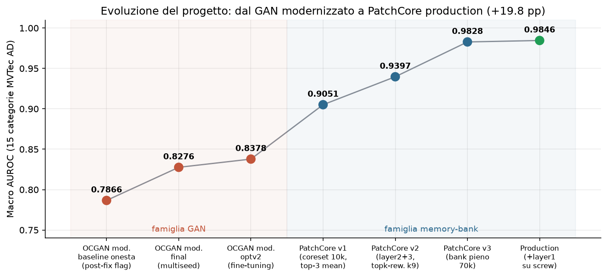
*Figura 1 — L'evoluzione del macro AUROC su MVTec AD (15 categorie) lungo tutto il progetto: la famiglia generativa (rosso) migliora ma satura; la famiglia a memory bank (blu/verde) cambia regime.*

Tre principi hanno guidato tutto il lavoro, e questa relazione li riflette. Il primo è l'onestà sperimentale: protocollo a quattro split con un test set mai usato per il tuning, multi-seed obbligatorio, numeri sempre riportati con la loro deviazione standard, e bug raccontati invece che nascosti. Il secondo è che l'ablation viene prima delle opinioni: ogni componente è stato acceso, spento e pesato in griglie sistematiche — oltre 11.000 run complessivi su disco — e alcune componenti a cui eravamo affezionati sono state eliminate semplicemente perché i numeri le bocciavano (sezione 5.5). Il terzo, infine, è il confronto costante con il paper di partenza: ogni nostra scelta è messa in relazione con la corrispondente scelta di OCGAN, e la sezione 7.3 tira le somme di questo dialogo.

### Come leggere la relazione

La sezione 2 descrive in dettaglio il paper di partenza. La sezione 3 è un glossario ragionato di tutte le tecniche usate nel progetto (memory bank, teacher–student, learned fusion e così via): chi le conosce già può saltarla e tornarci attraverso i rimandi. La sezione 4 descrive dataset, protocollo sperimentale e l'infrastruttura cloud su cui tutto è girato (Paperspace). Le sezioni 5 e 6 sono il cuore sperimentale, con architettura e funzionamento di ogni modello, le versioni successive e le scelte fatte, ciascuna con i suoi pro e contro. La sezione 7 mette tutto a confronto, anche con il paper originale, mentre la sezione 8 raccoglie problemi e lezioni. Le appendici, in chiusura, riportano le tabelle complete per categoria.

---

# 2. Il punto di partenza: il paper OCGAN (CVPR 2019)

## 2.1 Il problema

Nella one-class novelty detection il training set contiene una sola classe ("in-class") e al momento del test bisogna distinguere gli esempi in-class da quelli out-of-class. L'approccio classico è l'autoencoder: lo si addestra a ricostruire la classe normale e si usa l'errore di ricostruzione come punteggio di anomalia, assumendo che ciò che il modello non sa ricostruire sia, per l'appunto, anomalo.

Il paper parte però da un'osservazione sperimentale che demolisce questa assunzione: un autoencoder addestrato soltanto sulla cifra 8 di MNIST ricostruisce sorprendentemente bene anche 1, 5, 6 e 9. Il motivo è che le feature apprese — curve, tratti — sono abbastanza generiche da rappresentare anche ciò che la rete non ha mai visto; di conseguenza l'errore di ricostruzione sugli outlier resta basso e il sistema produce falsi negativi.

## 2.2 L'intuizione chiave

> Non basta chiedere che la classe normale sia ben rappresentata nello spazio latente: bisogna chiedere che l'intero spazio latente rappresenti solo la classe normale.

OCGAN attacca quindi il problema "in negativo". Invece di limitarsi a minimizzare l'errore sugli esempi normali, esplora attivamente lo spazio latente a caccia delle regioni che producono immagini fuori classe, e costringe il generatore a "normalizzarle". La logica è stringente: se ogni punto del latente decodifica in qualcosa che sembra in-class, allora un esempio out-of-class non può che essere ricostruito male — ed è esattamente ciò che vogliamo da un punteggio di anomalia.

## 2.3 L'architettura: quattro componenti

OCGAN è composto da quattro reti che si allenano insieme, riassunte nella tabella seguente.

| Componente | Struttura | Ruolo |
|---|---|---|
| **Denoising autoencoder** (En + De) | encoder: 3 conv 5×5 stride 2, BatchNorm, LeakyReLU(0.2), 64 canali base; latent limitato con **tanh** in (−1,1)^d; decoder simmetrico con 3 deconvoluzioni | ricostruire l'input (a cui viene aggiunto rumore gaussiano con σ² = 0.2); l'errore di ricostruzione è lo score finale |
| **Latent discriminator** D_l | MLP fully-connected 128→64→32→16 | distingue i latent "veri" (encodings di immagini normali) da campioni **uniformi** U(−1,1)^d; in equilibrio costringe l'encoder a distribuire i latent su tutto il cubo |
| **Visual discriminator** D_v | CNN leggera (12 canali base) | distingue le immagini **generate da latent casuali** dalle immagini reali: ogni punto del cubo latente deve decodificare in qualcosa di plausibilmente in-class |
| **Classifier** C | CNN (64 canali base) | classificatore "debole" che giudica quanto un'immagine generata sembra in-class (positivi = ricostruzioni, negativi = generazioni da latent casuali); non serve allo score, serve a **guidare il mining** |

Due dettagli di design meritano attenzione particolare, perché torneranno più volte nel resto della relazione. Il primo è il tanh sul latente, che rende lo spazio dei codici un cubo chiuso e limitato: solo grazie a questo vincolo ha senso campionarci dentro in modo uniforme e "pattugliarlo" per intero. Il secondo è il denoising, cioè l'aggiunta di rumore all'input, che evita la soluzione banale dell'identità e al tempo stesso regolarizza il training.

## 2.4 L'informative-negative mining

È il contributo più originale del paper, e funziona così. A ogni iterazione si campionano punti casuali nel cubo latente; per ciascun punto si esegue poi un gradient ascent nel latente per 5 passi, massimizzando il giudizio "out-of-class" del classifier C — in altre parole ci si sposta deliberatamente verso le regioni dove il generatore produce immagini che *non* sembrano appartenere alla classe normale. I punti così trovati, detti "negativi informativi", vengono infine usati per addestrare il generatore a produrre immagini in-class anche lì.

In pratica si tratta di una ricerca adversariale interna al modello, parente stretta degli attacchi PGD: invece di aspettare che il caso esponga le zone difettose del latente, le si va a cercare attivamente con il gradiente. Vale la pena anticipare che questa idea sopravvive, opportunamente modernizzata, anche nel nostro modello (sezioni 3.5 e 5.4): è il pezzo di OCGAN che abbiamo conservato più volentieri.

## 2.5 Training e loss

Il training alterna due step: prima si aggiorna il classifier C, poi — con C congelato — si aggiornano autoencoder e discriminatori in modo adversariale. La loss del generatore è:

```
L = 10 · MSE(ricostruzione) + l_latent (adversarial vs D_l) + l_visual (adversarial vs D_v)
```

Quel peso 10 sulla MSE dice già molto della filosofia del metodo: la ricostruzione resta il segnale dominante, mentre l'apparato adversariale è una regolarizzazione dello spazio, non il fine. Coerentemente, la model selection è fatta sull'MSE di validazione.

## 2.6 I risultati del paper

Il paper valuta su dataset di immagini piccole e mono-oggetto, con due protocolli distinti.

| Protocollo | Dataset | Risultato (mean AUROC) |
|---|---|---|
| P1 (80/20 in-class, test bilanciato) | MNIST | 0.977 |
| P1 | COIL-100 | 0.995 |
| P1 | fashion-MNIST | 0.924 |
| P2 (split nativi del dataset) | MNIST | **0.9750** (vs Deep-SVDD 0.9480, AND 0.9671) |
| P2 | CIFAR-10 | **0.6566** (vs Deep-SVDD 0.6481) |

Su MNIST, OCGAN rappresentava lo stato dell'arte del momento. Su CIFAR-10, invece, il margine sul concorrente è minimo e il valore assoluto è basso: il metodo fatica visibilmente quando la "classe normale" è visivamente eterogenea, e questo limite ci tornerà utile per interpretare i risultati su MVTec.

## 2.7 L'ablation del paper

Gli autori smontano il proprio modello pezzo per pezzo (su MNIST, protocollo P2), e il risultato è istruttivo.

| Configurazione | mean AUROC |
|---|---|
| Solo autoencoder | 0.957 |
| + latent discriminator | 0.959 |
| + visual discriminator | 0.971 |
| + classifier / mining (modello completo) | **0.975** |

Vale la pena notare la forma di questa curva: la base ricostruttiva fa quasi tutto il lavoro, e ogni componente adversariale aggiunge poco. Ritroveremo una struttura analoga, ma con pesi completamente diversi, nella nostra ablation (sezione 5.5 e figura 11) — ed è proprio dal confronto tra le due che usciranno alcune delle conclusioni più interessanti del progetto.

## 2.8 I limiti (dichiarati e non)

I limiti del metodo si possono leggere su tre piani. Sul piano dichiarato dagli stessi autori, OCGAN funziona quando la classe normale è un concetto singolo e centrato (MNIST, COIL, fashion-MNIST); su CIFAR-10, dove convivono più classi di sfondi e di pose, il metodo è molto più debole. Sul piano pratico, scoperto da noi, il repository ufficiale è scritto in MXNet — un framework ormai abbandonato — mentre la reimplementazione TensorFlow disponibile è minimale; in più, i risultati pubblici sono misurati una sola volta per cifra, senza alcuna varianza, il che li rende fragili dal punto di vista statistico ed è il motivo diretto del nostro obbligo di multi-seed (sezione 4.4). C'è infine un limite strutturale: tutto il design è pixel-centrico, cioè assume che l'immagine grezza sia il segnale. Su immagini industriali ad alta risoluzione, con difetti piccoli e texture complesse, vedremo che proprio questo è il vero tetto della famiglia generativa (sezioni 5.9 e 7).

---
# 3. Le tecniche utilizzate, spiegate una per una

Questa sezione è il glossario ragionato di tutte le tecniche comparse nel progetto. Per ciascuna proviamo a rispondere alle stesse tre domande — che cos'è, come funziona, dove la usiamo — ma in forma discorsiva, così che il lettore possa anche solo scorrerla e tornarci dai rimandi delle sezioni successive.

## 3.1 Backbone pre-addestrato e congelato

La tecnica più pervasiva di tutto il progetto è l'uso di una CNN addestrata su ImageNet — ResNet50 nel modello GAN, WideResNet50-2 in PatchCore — come estrattore di feature i cui pesi non vengono mai aggiornati. L'idea si regge su una proprietà ben nota: i layer intermedi di una rete che ha visto milioni di immagini naturali producono descrizioni locali (texture, bordi, parti di oggetti) talmente generali da funzionare anche su domini mai incontrati. Per l'anomaly detection questo è prezioso per due ragioni. La prima è banale ma decisiva: non avrebbe senso imparare quelle feature da zero partendo da poche centinaia di immagini. La seconda è più sottile: congelare i pesi impedisce il "catastrophic forgetting" della generalità, perché una rete fine-tunata solo su immagini normali potrebbe specializzarsi al punto da mappare normale e difettoso sugli stessi codici. Nel progetto questa tecnica compare letteralmente ovunque — nell'encoder del GAN modernizzato (sezione 5.3), nella perceptual loss, nel memory bank, nel teacher–student e, portata all'estremo, come unico componente di PatchCore — ed è la differenza più profonda rispetto a OCGAN 2019, che il suo encoder lo addestrava da zero.

## 3.2 Perceptual loss (feature loss)

La perceptual loss è una loss di ricostruzione calcolata nello spazio delle feature di una rete pre-addestrata invece che sui pixel. In concreto, ricostruzione e originale vengono ri-encodate dal backbone e si confrontano le rispettive feature (nel nostro caso ai layer 2, 3 e 4, con peso 0.1). Il punto è che due immagini possono essere vicine pixel per pixel ma semanticamente diverse, e viceversa: la perceptual loss premia la somiglianza percettiva e penalizza l'oversmoothing tipico della sola MSE. La usiamo nello stack di ricostruzione del GAN modernizzato (L1 + MS-SSIM + perceptual) e come una delle teste di score (`norm_perceptual`); il paper OCGAN, per confronto, usava soltanto la MSE.

## 3.3 MS-SSIM

La Multi-Scale Structural Similarity è una misura di somiglianza strutturale — luminanza, contrasto, struttura locale — calcolata a più scale. Invece di confrontare i singoli pixel, confronta statistiche locali di patch a risoluzioni diverse: per questo è molto più sensibile della MSE alle alterazioni di struttura, che sono esattamente ciò che costituisce un difetto, e al tempo stesso più tollerante verso piccole differenze di intensità globale. Nel nostro modello entra nella loss di ricostruzione insieme alla L1 (abbiamo eliminato del tutto la MSE) e nel calcolo dello score di ricostruzione.

## 3.4 Latent compactness (stile Deep-SVDD)

Si tratta di una regolarizzazione che spinge i codici latenti delle immagini normali a concentrarsi attorno a un centro. Il riferimento è Deep-SVDD, che impara una sfera minima capace di racchiudere le rappresentazioni dei dati normali e usa la distanza dal centro come punteggio di anomalia. La nostra versione è più leggera: un termine di compattezza (peso 0.1) sulla testa latente (`compact_latent`, 128 dimensioni), più uno score opzionale "one-class" basato sulla distanza dal centro.

Questa tecnica è il nostro erede diretto del latent discriminator di OCGAN, anche se il meccanismo è rovesciato: il paper costringeva i latent a riempire uniformemente un cubo, noi li costringiamo a stringersi attorno a un centro. La filosofia, controllare la geometria dello spazio latente, è la stessa. Una nota di onestà è però doverosa: nella configurazione finale lo *score* one-class è disattivato, perché l'ablation lo ha bocciato senza appello (sezione 5.5); resta attiva soltanto la regolarizzazione in loss.

## 3.5 Informative-negative mining moderno (PGD-style)

È la versione modernizzata del mining di OCGAN descritto in sezione 2.4: una ricerca attiva, guidata dal gradiente, dei punti latenti che producono ricostruzioni "difficili". Rispetto al paper cambiano i dettagli operativi: il nostro mining è multi-step in stile PGD ma con 3 passi invece di 5, parte solo dopo la prima epoca (warmup) ed è guidato dallo score composito invece che da un classificatore dedicato. I negativi trovati alimentano il training della branch discriminativa. Lo usiamo nel GAN modernizzato, ed è l'idea di OCGAN che abbiamo conservato più volentieri proprio perché è indipendente dall'architettura.

## 3.6 Anomalie sintetiche (CutPaste, Perlin, perturbazioni in feature space)

Le anomalie sintetiche sono difetti artificiali generati al volo sulle immagini normali, allo scopo di dare al modello esempi "negativi" senza possedere veri difetti. Ne usiamo tre famiglie. Con CutPaste si ritaglia una patch dall'immagine e la si incolla altrove (p = 0.5 nel nostro training), creando discontinuità locali simili a graffi o contaminazioni. Con le maschere di Perlin si usa un rumore coerente a bassa frequenza come maschera per fondere texture estranee, ottenendo difetti dalle forme organiche (è la strada scelta nella variante optv2). Con le perturbazioni gaussiane in feature space, sulla linea di SimpleNet, si aggiunge invece rumore direttamente alle feature del backbone (per noi al layer4): "difetti semantici" a costo zero in pixel.

Le impieghiamo per addestrare la branch discriminativa del GAN modernizzato e per popolare il segnale di validazione. Il rischio è noto, ed è il motivo per cui le usiamo con prudenza: il modello può imparare a riconoscere *l'artefatto sintetico* invece del concetto di difetto.

## 3.7 Branch discriminativa (stile DRAEM)

La branch discriminativa è una testa di rete addestrata in modo supervisionato a distinguere il normale dall'anomalo, usando come esempi anomali le anomalie sintetiche appena descritte. Il riferimento è DRAEM, che concatena immagine e relativa ricostruzione e addestra una rete a segmentare il difetto; la nostra versione, più semplice, produce uno score discriminativo a livello immagine (`norm_discriminative`) a partire da input e ricostruzione. È una delle 7 teste di score del GAN modernizzato e si può leggere come il discendente funzionale del classifier C di OCGAN — addestrato però su difetti sintetici realistici invece che su generazioni da latent casuali.

## 3.8 Memory bank + nearest neighbour (PatchCore) e coreset

Qui l'idea di fondo è quasi provocatoria: non addestrare nulla. Si memorizzano le feature locali (patch) di tutte le immagini normali di training in una "banca", e al test si misura quanto ogni patch dell'immagine dista dalla patch normale più vicina. Il flusso è lineare: ogni immagine di training passa nel backbone congelato e le sue mappe di feature — per noi layer2 e layer3 di WideResNet50-2, concatenate dopo un riallineamento spaziale — diventano un insieme di vettori-patch; tutti i vettori finiscono nel memory bank; al test, per ogni patch dell'immagine si calcola la distanza dal vicino più prossimo nel bank, e l'aggregazione delle distanze patch-level produce lo score dell'immagine (sezione 3.9). Se il bank diventa troppo grande entra in gioco il coreset subsampling k-center-greedy: si seleziona iterativamente il punto più lontano dall'insieme già scelto, ottenendo un sottoinsieme che "copre" bene lo spazio con una frazione dei punti.

Nel progetto il memory bank compare in due regimi molto diversi, ed è una delle lezioni più interessanti dell'intero lavoro (sezione 8.5): come score ausiliario dentro il GAN modernizzato (bank piccolo, 1024–4096 patch, aggregazione max) e come modello a sé stante in PatchCore (bank pieno fino a 70.000 patch, top-k reweighted) — dove diventa la svolta dell'intero progetto.

## 3.9 Aggregazione top-k reweighted

Resta da definire come si passa dalle distanze delle singole patch allo score dell'immagine. Le alternative che abbiamo provato sono tre: il massimo, che è fragile perché un solo outlier di feature decide tutto; la media dei top-k (`topk_mean`, con k = 3 in PatchCore v1); e infine il top-k reweighted con k = 9, in cui si prendono le k patch più anomale e le si pesa con un softmax sulle distanze. Quest'ultimo è un compromesso che valorizza il picco senza dipendere da una sola patch, ed è la generalizzazione del reweighting proposto nel paper PatchCore originale. Il `topk_reweighted` con k = 9 è uno dei tre ingredienti della svolta di PatchCore v2/v3 (sezione 6.3).

## 3.10 Teacher–Student (stile RD4AD)

Lo schema teacher–student impiega due reti: un teacher pre-addestrato e congelato e uno student addestrato a imitarne le feature *solo su immagini normali*. Sui dati normali lo student impara a riprodurre il teacher quasi perfettamente; su un'anomalia, che per definizione non ha mai visto, generalizza male e la discrepanza tra i due — calcolata per noi sui layer 3 e 4, in modo multiscala — esplode. Quella discrepanza è lo score. La usiamo come testa `norm_teacher_student` del GAN modernizzato, con peso in loss 0.05 e peso di score regolato dalla griglia di tuning (fattore `t`).

## 3.11 Learned fusion (regressione logistica) + normalizzazione MAD

La learned fusion è il meccanismo che fonde le 7 teste di score in un unico punteggio, e funziona in tre tempi. Anzitutto, poiché ogni score grezzo ha scala e distribuzione proprie, lo si normalizza in modo robusto con mediana e MAD (Median Absolute Deviation) calcolate su `val_normal`: a differenza di media e deviazione standard, mediana e MAD non si lasciano trascinare dagli outlier. Una regressione logistica addestrata su `val_mixed` (normali più anomalie) impara poi i pesi ottimali della combinazione, con il parametro di regolarizzazione C che è uno dei fattori della griglia (fattore `lf`). La soglia operativa, infine, si sceglie massimizzando F1 su `val_mixed`.

Vale la pena anticipare il risultato più netto di tutta l'ablation: la fusione appresa è il singolo fattore più importante del modello generativo, con +0.21 di AUROC medio rispetto allo score singolo (sezione 5.5). Considerando che il paper OCGAN usava un solo score (la MSE), questa è la differenza metodologica più redditizia che abbiamo introdotto.

## 3.12 Calibrazione della soglia

Per calibrazione intendiamo la scelta del valore di score oltre il quale un'immagine viene dichiarata anomala. L'AUROC non ne ha bisogno, essendo threshold-free, ma un sistema reale sì. Nel progetto usiamo due varianti. Per il GAN modernizzato la soglia è quella che massimizza F1 su `val_mixed`. Per il PatchCore di produzione è invece il 99° percentile degli score su `val_normal` — un 15% di immagini normali tenute fuori dal bank (seed 43) — il che garantisce per costruzione circa l'1% di falsi positivi attesi sulle immagini normali. Il motivo per cui le immagini del bank non si possono usare per calibrare è una trappola classica, raccontata in sezione 8.9.

## 3.13 Strumenti di training moderni

Chiudiamo il glossario con gli strumenti di contorno usati nel GAN modernizzato, tutti assenti nel paper del 2019 ma ormai standard. AdamW (lr 1e-4) è la variante di Adam con weight decay disaccoppiato. Il warmup con cosine schedule (2 epoche di warmup) fa salire dolcemente il learning rate per poi farlo decadere a coseno, stabilizzando le prime epoche adversariali. L'EMA dei pesi (decay 0.999) mantiene una media mobile esponenziale dei parametri e la usa per la valutazione, riducendo il rumore degli ultimi step. L'AMP, o mixed precision, esegue i calcoli in fp16 dove è sicuro e in fp32 dove serve, con un guadagno di circa 2× in training sulle GPU con tensor core — anche se vedremo un caso in cui l'fp16 in *inferenza* ci ha morso (sezione 8.6). Il gradient clipping limita la norma del gradiente e fa da paracadute contro i picchi adversariali. L'early stopping multi-metrica (pazienza 3), infine, lavora su una validazione composita: 0.5·AUROC + 0.3·AUPRC + 0.2·F1 su `val_mixed`.

---
# 4. Setup sperimentale: dataset, protocollo, infrastruttura

## 4.1 Il dataset: MVTec AD

Il banco di prova del progetto è MVTec AD, lo standard de facto per l'anomaly detection industriale. Si tratta di 15 categorie — 10 oggetti (bottle, cable, capsule, hazelnut, metal_nut, pill, screw, toothbrush, transistor, zipper) e 5 texture (carpet, grid, leather, tile, wood) — con immagini ad alta risoluzione, un training set composto esclusivamente da pezzi privi di difetti e un test set misto con difetti reali (graffi, contaminazioni, parti mancanti, deformazioni…), annotati anche a livello di pixel.

La scelta di MVTec al posto di MNIST o CIFAR, su cui era valutato il paper, è la decisione che dà senso a tutto il progetto: volevamo misurare le idee di OCGAN sul tipo di problema per cui l'anomaly detection one-class esiste davvero. Il prezzo da pagare è la rinuncia a qualsiasi confronto diretto numero-su-numero con il paper (ci torneremo in sezione 7.3); il guadagno è che ogni conclusione tratta qui è rilevante per un caso d'uso reale.

La pipeline di preprocessing è volutamente sobria: resize anti-aliased che preserva l'aspect ratio seguito da center crop a 256×256, normalizzazione ImageNet (necessaria quando si lavora con backbone pre-addestrati) e augmentation conservative sul train — piccole traslazioni e rotazioni, jitter di luminosità, rumore lieve. Conservative non per pigrizia, ma per principio: un'augmentation aggressiva *cambia la definizione di normalità* che il modello deve imparare.

## 4.2 Il protocollo a 4 split

Tutti gli esperimenti, senza eccezioni, usano quattro split.

| Split | Contenuto | Uso |
|---|---|---|
| `train_normal` | solo immagini normali | addestramento / costruzione bank |
| `val_normal` | normali tenute fuori | normalizzazione MAD degli score, calibrazione p99 |
| `val_mixed` | normali + anomalie | scelta di soglie, checkpoint, iperparametri, fusione |
| `test_blind` | il test ufficiale | **solo valutazione finale, mai per tuning** |

A questo si aggiungono le misure anti-leakage: deduplicazione tramite hash SHA-1 e controllo dei near-duplicate tra gli split, con le statistiche di normalizzazione calcolate solo sul train. È la risposta diretta al limite metodologico del paper, che riportava misure singole senza una separazione esplicita tra selezione e valutazione: nel nostro setup, ogni numero etichettato "test" è davvero blind.

## 4.3 Le metriche

La metrica principale è l'AUROC a livello immagine, threshold-free e confrontabile con la letteratura. La affianchiamo con l'AUPRC, più informativa quando le classi sono sbilanciate, con l'F1 alla soglia di validazione, che misura quanto è buono il sistema *operativo* e non solo il suo ranking, e con il FPR@95TPR, ovvero quanti falsi allarmi si pagano per catturare il 95% dei difetti — la metrica che interessa davvero a una linea di produzione. Il "macro AUROC" citato in tutta la relazione è la media non pesata sulle 15 categorie.

## 4.4 Multi-seed obbligatorio

Ogni risultato finale è la media di 3–5 seed (43–47), con deviazione standard riportata (tabella A2). Il motivo è già stato anticipato: i numeri pubblici di OCGAN sono misurati una volta sola, e la nostra esperienza ha mostrato deviazioni standard per-categoria fino a ±0.17 — è il caso di toothbrush nel GAN finale. Un singolo run, in altre parole, può raccontare qualunque storia.

## 4.5 Paperspace: l'infrastruttura cloud del progetto

Tutti i training sono stati eseguiti su Paperspace Gradient, e vale la pena spendere qualche riga su che cosa sia e perché si sia rivelato adatto a un progetto come questo.

Paperspace Gradient è una piattaforma cloud di GPU computing orientata al machine learning: si lancia un *notebook* — in realtà un container Linux con Jupyter e terminale — su una macchina con GPU dedicata, pagando a consumo. Lo storage di progetto (`/notebooks/storage/...`) è persistente e sopravvive allo spegnimento dell'istanza, mentre la macchina vera e propria è effimera: a ogni sessione si riceve un host diverso, come testimoniano gli hostname sempre nuovi nei nostri `env_info.yaml` (`nzujijoayr`, `n3jmv9eyss`, `na1gz7w04r`…).

I vantaggi, per un progetto fatto di lunghe campagne sperimentali, sono stati concreti. Il primo è l'accesso a GPU da workstation a costo orario: la griglia di ablation è girata su una NVIDIA RTX A4000 da 16 GB e i retrain optv2 su una Quadro RTX 5000 da 16 GB — hardware fuori portata per un laptop, affittato solo per le ore di training effettive. Il secondo è l'assenza totale di amministrazione: l'ambiente CUDA arriva già pronto (Python 3.11.7 e PyTorch 2.10.0+cu128 sull'istanza della griglia, PyTorch 2.1.1+cu121 su quella di optv2), senza driver da installare. Il terzo è lo storage persistente, dove dataset, checkpoint e log restano tra una sessione e l'altra: le circa 11.700 directory di output della griglia sono state scritte lì e poi sincronizzate in locale. Il quarto, infine, è la scalabilità del "fire-and-forget": si lancia uno script di griglia la sera, si spegne il laptop e l'istanza macina da sola, con il costo che segue l'uso.

I contro li abbiamo vissuti sulla nostra pelle, e li raccontiamo in dettaglio in sezione 8.7. Il principale: istanze effimere più sincronizzazione manuale del codice fuori da git producono inevitabilmente drift. Il codice veniva copiato tra locale e cloud file per file, e alcune modifiche fatte "al volo" su Paperspace — il `base_trainer.py` è arrivato a +1235 righe non committate — non sono mai rientrate nel repository; mesi dopo, la calibrazione archiviata di optv2 non era più riproducibile con il codice committato. In secondo luogo, la pulizia dello storage è a carico dell'utente: i run cancellati finiscono in `.Trash-0` e continuano a occupare quota, tanto che la prima campagna di griglia (3.300 run) è stata eliminata per far posto alla seconda e sopravvive solo nei CSV aggregati e nel diario di progetto. Infine, le GPU sono disponibili a rotazione e il tipo di scheda può cambiare tra sessioni (A4000 ↔ RTX 5000): innocuo per i risultati, ma è un'altra variabile da registrare, ed è il motivo per cui ogni run salva il proprio `env_info.yaml`.

Il laptop locale (Quadro T1000, 4 GB) ha mantenuto comunque un ruolo preciso: sviluppo, smoke test e soprattutto l'inferenza live della webapp (sezione 9) — dove proprio l'hardware consumer ci ha regalato il bug più istruttivo del progetto, l'overflow fp16 di sezione 8.6.

## 4.6 Riproducibilità by design

Ogni run salva la configurazione YAML completa e risolta, un `env_info.yaml` con GPU, versioni, hostname e commit git, il seed, i checkpoint top-k e i log per epoca. Non è un dettaglio cosmetico: il repository è stato rifondato all'inizio del progetto proprio attorno a questi requisiti (sezione 5.2), e senza di essi le campagne delle sezioni successive non sarebbero state gestibili.

---

# 5. Fase 1 — OCGAN modernizzato (il "binario B")

## 5.1 La strategia

All'inizio del progetto erano sul tavolo due strade. Il binario A consisteva nel riprodurre e difendere OCGAN così com'è, portandolo su MVTec con modifiche minime; il binario B, al contrario, trattava OCGAN come una fonte di idee — ricostruzione, controllo del latente, mining — da innestare in una pipeline allo stato dell'arte: backbone pre-addestrato, score multipli, anomalie sintetiche, memory bank, teacher–student, fusione appresa.

Abbiamo scelto il binario B, per una ragione che il paper stesso suggerisce (sezione 2.8): l'architettura del 2019 è progettata per immagini di 28–32 pixel con un solo concetto al centro, e nessuna quantità di tuning l'avrebbe resa competitiva su immagini industriali a 256 pixel. I riferimenti moderni da cui abbiamo attinto sono PaDiM, PatchCore, DRAEM, RD4AD, EfficientAD e SimpleNet.

Come ogni scelta del progetto, anche questa ha i suoi pro e i suoi contro, ed è giusto dichiararli subito. A favore: ogni componente moderno diventa misurabile via ablation, e il progetto produce un sistema rilevante invece di un reperto. Contro: il "modello" diventa una pipeline complessa con molti iperparametri — ed è esattamente il motivo per cui la griglia di ablation delle sezioni 5.5 e 5.6 ha dovuto essere così grande.

## 5.2 La rifondazione del repository

Prima di qualunque esperimento, il codice è stato riscritto da zero in PyTorch modulare: `configs/` (in stile Hydra, con ogni run che salva il config risolto), `datasets/`, `models/` (backbone, reconstruction, score heads), `losses/`, `miners/`, `scorers/`, `metrics/`, `trainers/`, `callbacks/`, `scripts/`. A questo si è aggiunto l'hardening: seed e determinismo, resume, checkpoint top-k, logging d'ambiente, multi-run, smoke test e NaN-test automatici, AMP, gradient accumulation, EMA, profiler.

Anche qui il bilancio va dichiarato. Da un lato, la griglia da oltre 11.000 run sarebbe stata semplicemente impossibile senza run "lanciabili a lotti" e auto-documentanti. Dall'altro, sono state settimane di ingegneria prima del primo numero utile: un investimento che si è ripagato, ma che all'inizio è sembrato lentezza, ed è onesto ammettere che la tentazione di saltarlo c'è stata.

## 5.3 L'architettura del nostro modello, nel dettaglio

Il modello finale della fase 1 (`ReconstructionModel` nel codice) è organizzato così:

```
immagine 256×256
   │
   ▼
ResNet50 pre-addestrato, CONGELATO          ──► feature layer1…layer4 + global pool
   │                                              │
   ▼                                              │ (le stesse feature alimentano:
projection MLP (Linear → ReLU → Linear)           │  perceptual loss, memory bank,
   │        global_dim → latent 128               │  teacher–student, feature score)
   ▼                                              │
latent compatto z ∈ R^128  (compactness 0.1)      │
   │                                              │
   ▼                                              ▼
BaseReconstructor (decoder)                ri-encoding della ricostruzione
   fc: 128 → 256·8·8                       con lo stesso backbone congelato
   poi 5 × [Upsample ×2 bilineare           (recon_layer1…4 + recon_global)
            → Conv 3×3 → BN → ReLU]
   → Conv finale + Sigmoid
   8×8 → 256×256, canali 256→3
```

Il forward è il seguente. L'immagine passa nel backbone congelato; il global pooling viene proiettato da un MLP in un latente di 128 dimensioni; da lì il decoder (`BaseReconstructor`) risale da 8×8 a 256×256 con cinque blocchi upsample+conv — upsampling bilineare seguito da convoluzione, la scelta classica anti-checkerboard al posto delle deconvoluzioni del paper 2019. La ricostruzione viene infine ri-encodata dallo stesso backbone, in modo da poter confrontare originale e ricostruzione anche in feature space.

Da questo flusso il modello estrae sette punteggi di anomalia, ognuno normalizzato con MAD su `val_normal` (sezione 3.11):

| Testa | Segnale |
|---|---|
| `norm_recon` | errore di ricostruzione in pixel (L1 + MS-SSIM) |
| `norm_perceptual` | distanza tra feature di originale e ricostruzione (layer 2–4) |
| `norm_feature` | discrepanza di feature aggiuntiva (global) |
| `norm_latent` | anomalia nello spazio latente |
| `norm_memory` | distanza kNN da un piccolo memory bank di patch normali (layer3) |
| `norm_discriminative` | branch discriminativa addestrata su anomalie sintetiche |
| `norm_teacher_student` | discrepanza teacher–student (layer 3–4) |

La regressione logistica su `val_mixed` fonde le sette teste; la soglia è scelta a best-F1.

Per chiudere il quadro, ecco il confronto diretto con OCGAN 2019, architettura per architettura:

| | OCGAN (paper) | Nostro modello |
|---|---|---|
| Encoder | 3 conv da zero, 64 ch | ResNet50 ImageNet **congelato** |
| Latent | tanh-bounded (−1,1)^d, riempito uniformemente (D_l) | 128-d, **compattato** attorno a un centro (Deep-SVDD-like) |
| Decoder | 3 deconv | 5 blocchi upsample bilineare + conv 3×3 + BN + ReLU |
| Loss ricostruzione | 10·MSE | **L1 + MS-SSIM + perceptual 0.1** (niente MSE) |
| Negativi | generazioni da latent casuali | **anomalie sintetiche** (CutPaste / Perlin / gaussian feature) |
| Mining | 5 step gradient ascent guidati dal classifier | 3 step PGD-like guidati dallo score composito, warmup 1 epoca |
| Score | solo MSE | **7 teste fuse con regressione logistica** |
| Discriminatori adversariali | D_l + D_v | nessuno (sostituiti da compactness + branch discriminativa supervisionata) |

L'ultima riga merita una nota. Abbiamo rinunciato al training adversariale vero e proprio — instabile, sensibile, costoso da bilanciare — mantenendo però la *funzione* dei due discriminatori con mezzi più stabili: la compattezza del latente al posto di D_l, la branch discriminativa su anomalie sintetiche al posto di D_v più classifier. Il vantaggio è un training stabile e riproducibile su 15 categorie per decine di configurazioni; lo svantaggio è la perdita dell'eleganza della "pattuglia del latent space" del paper, di cui il mining conserva comunque lo spirito.

Nel codice esistono anche varianti del decoder: oltre al `base_reconstructor` appena descritto ci sono `residual_reconstructor` (blocchi residui) e `unet_reconstructor` (skip connection dalle feature layer1–4 dell'encoder). Le skip, però, sono un'arma a doppio taglio in anomaly detection: se troppo forti, il decoder finisce per "copiare" l'input difetti compresi, azzerando il segnale di ricostruzione. La configurazione finale usa quindi il `base_reconstructor` puro — e proprio attorno al flag `use_skip_connections` è nato uno dei bug più istruttivi del progetto (sezioni 5.7 e 8.8).

## 5.4 Il training

La configurazione comune a tutta la fase sperimentale è la seguente: AdamW con lr 1e-4, warmup di 2 epoche seguito da cosine schedule, EMA 0.999, AMP, gradient clipping, early stopping con pazienza 3 sulla metrica composita di `val_mixed`, massimo 100 epoche, batch a 256 px. Le anomalie sintetiche combinano CutPaste con p = 0.5 in pixel space e una perturbazione gaussiana al layer4 in feature space; il mining lavora su 3 step ed è attivo dopo la prima epoca.

## 5.5 Campagna 1 — la griglia on/off (3.300 run): cosa serve davvero?

La prima campagna di ablation ha acceso e spento i quattro componenti principali — **t**eacher–student, **m**emory bank, **l**earned **f**usion, **o**ne-**c**lass score — su tutte le 15 categorie, e lo ha fatto in due "spazi" di configurazione: lo old space (1.380 run), con gli iperparametri di contorno della prima implementazione, ha prodotto un AUROC medio di 0.7352; il new space (1.920 run), nato dopo la revisione di preprocessing, loss e schedule, è salito a 0.8392. Già da qui emerge una prima lezione: il contesto vale +0.10 di AUROC prima ancora di toccare i componenti.

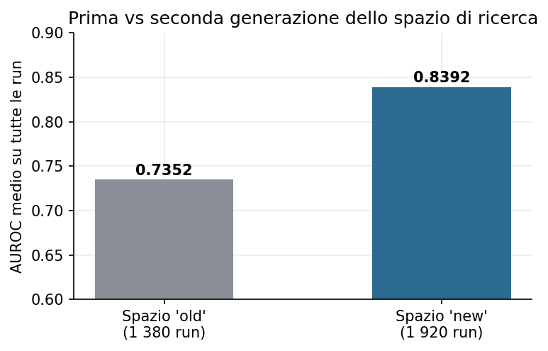
*Figura 3 — Stessa griglia di componenti, due spazi di iperparametri: il contesto vale +0.10 AUROC prima ancora di toccare i componenti.*

L'effetto dei singoli fattori, misurato come AUROC medio su tutti i run della campagna, è riassunto nella figura 2 e nella tabella seguente.

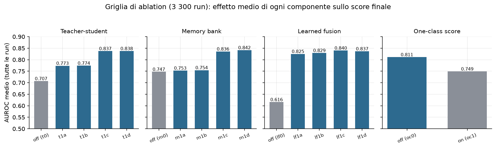
*Figura 2 — Effetto marginale dei quattro fattori della griglia on/off.*

| Fattore | Spento | Acceso (migliore variante) | Δ |
|---|---|---|---|
| **Learned fusion** | 0.6158 | **0.8397** (lf1c) | **+0.224** |
| Teacher–student | 0.7069 | 0.8375 (t1d) | +0.131 |
| Memory bank | 0.7474 | 0.8415 (m1d) | +0.094 |
| One-class score | **0.8110** (oc0) | 0.7489 (oc1) | **−0.062** |

Da questi numeri discendono tre conclusioni nette. La prima: la fusione appresa è IL fattore, con +0.22 da sola. Un singolo score, per quanto buono, non basta su 15 categorie eterogenee, perché ciò che separa normale da difettoso su `carpet` (una texture) non è ciò che li separa su `transistor` (una struttura); la regressione logistica impara, categoria per categoria, *quale mix di segnali guardare*. La seconda: teacher–student e memory bank aiutano in modo sostanziale, e non è un caso che siano proprio i due segnali "a feature congelate" — qui c'è già il presagio della fase 2, perché i segnali che non dipendono dal training del GAN si rivelano i più affidabili. La terza, più scomoda: lo score one-class fa danno, togliendo in media 0.06 di AUROC. La distanza dal centro del latente è ridondante rispetto alle altre teste e rumorosa, ed è stata disattivata (oc0) nella configurazione finale *nonostante fosse l'erede concettuale del cuore di OCGAN* — l'ablation non guarda in faccia l'affetto per le idee. La regolarizzazione di compattezza in loss, va precisato, resta attiva: aiuta la geometria del latente anche senza usare quella distanza come score.

> **Nota di archivio**: i 3.300 run di questa campagna sono documentati nei CSV aggregati e nel diario di progetto; le directory originali sono state eliminate dallo storage Paperspace per liberare quota (sezione 4.5). La campagna i cui run sono ancora integralmente su disco è la seconda, descritta qui sotto.

## 5.6 Campagna 2 — il tuning dei pesi (11.738 run su disco)

Stabilito *cosa* tenere acceso, la seconda griglia ha cercato *quanto* pesare ogni componente. Sul disco del progetto ci sono 11.738 directory di run (datate 28/03/2026, RTX A4000), con naming `{categoria}_{t}_{m}_{lf}_{mp}_{oc}_s{seed}`: 192 combinazioni × 15 categorie × 4 seed (43–46). La mappatura dei codici, ricostruita e verificata facendo il diff dei config YAML salvati nei run, è la seguente.

| Codice | Parametro | Valori |
|---|---|---|
| `t0x/t1a/t1b/t1d` | `teacher_student.score_weight` | 0.05 / 0.1 / 0.2 / 0.4 |
| `m0x/m1b/m1d/m1f` | `memory_bank.score_weight` | 0.02 / 0.1 / 0.4 / 0.6 |
| `lf1b/lf1c/lf1d/lf1g` | C della regressione logistica | 1 / 2 / 4 / 8 |
| `mp1a/mp1b/mp1c` | `max_patches` del memory bank | 1024 / 2048 / 4096 |
| `oc0` | `one_class.score_weight` = 0 | (loss di compattezza 0.1 sempre attiva) |

Una sotto-ablation dedicata al memory bank ausiliario (45 run, layer3, aggregazione max) ha prodotto un risultato controintuitivo: più patch NON è meglio. La configurazione p1024 dà un AUROC medio di 0.8753, contro 0.8611 di p2048 e 0.8551 di p4096. Con l'aggregazione `max` e il coreset k-center, infatti, un bank più grande aggiunge più rumore di quanta copertura porti. Conviene tenere a mente questo risultato, perché in PatchCore puro scopriremo l'esatto contrario — lì il bank pieno è la svolta — ed è un'apparente contraddizione che si scioglie solo guardando *come* il bank viene interrogato (sezioni 6.4 e 8.5, figura 9).

La shortlist finale (16 epoche, 15 categorie × seed 43–46) ha incoronato:

> **`t1d_m1d_lf1c_oc0`** — teacher 0.4, memory 0.4, C = 2, niente one-class score:
> macro AUROC **0.8510** (±0.0240 tra seed), AUPRC 0.9261, F1 0.9149, FPR@95 0.4475; peggior categoria 0.6301.

Il runner-up `t1a_m1a_lf1b_oc0` (0.8456) vinceva in realtà più categorie singole, sei: la vincitrice è stata scelta per la media e la stabilità, non per i picchi. È una preferenza che ha un costo dichiarato — si rinuncia a circa sei vittorie per-categoria — ma garantisce la robustezza cross-categoria che un sistema "general purpose" deve avere. Ed è anche il primo indizio di un tema che tornerà: "un modello solo per tutte le categorie" è un vincolo costoso.

## 5.7 Lo Sprint 1: i flag morti e il reset dell'onestà

Durante il consolidamento del codice è emerso che tre flag di configurazione erano "morti": `use_skip_connections`, `unfreeze_from` e `scoring_topk` venivano letti dal config ma ignorati dal builder del modello. Tutti i run che credevano di usare skip connection o backbone parzialmente sbloccato avevano in realtà addestrato il `base_reconstructor` puro su backbone interamente congelato.

La conseguenza era seria: parte dei numeri storici descriveva un'architettura diversa da quella dichiarata. Dopo il fix e il re-test, la baseline onesta della famiglia GAN si è assestata a macro AUROC **0.7866**. È il punto di partenza della curva di figura 1 — più basso dei numeri "pre-fix", ma vero. I dettagli, e soprattutto la morale, sono in sezione 8.3.

## 5.8 Le tre famiglie finali del GAN: `final`, `production`, `optv2`

Dalla configurazione vincente sono derivate tre famiglie di run, tutte verificate sul disco con il diff dei config.

La prima, **`{cat}_final`**, è la misura ufficiale multi-seed: 53 run di marzo 2026 con seed 43–45, estesi a 5 seed sulle categorie difficili (cable, metal_nut, pill, transistor), con pesi di score teacher 0.1 e memory 0.2, C = 5, `max_patches` 1024 e CutPaste. Il risultato è un macro AUROC di **0.8276** (tabella A2).

La seconda, **`{cat}_production`**, è il run da cui provengono i checkpoint deployati nella webapp: 15 run di aprile 2026, seed 43, `save_best=True`, con teacher 0.4, memory 0.02, C = 1 e `max_patches` 4096. I suoi checkpoint sono i `production_models/{cat}/model.pt` serviti live dall'arena come variante "ocgan_final" (sezione 9).

La terza, **`{cat}_optv2`**, è il retrain ottimizzato — 45 run, cioè 15 categorie per 3 seed, aprile 2026, Quadro RTX 5000 — ed è l'esperimento "spingiamo il GAN al massimo". Le differenze rispetto a final sono parecchie: backbone parzialmente sbloccato da layer3 in su (87 parametri, learning rate ridotto di 10 volte); `use_skip_connections=true` nel config, che però il builder dell'epoca ignorava ancora, per cui i checkpoint restano dei `base_reconstructor` (sezione 8.8); anomalie sintetiche Perlin al posto di CutPaste; augmentation più forti (rotazioni 5°, jitter 0.08, rumore 0.008); `scoring_topk` = 100, fusione con cross-validation a 5 fold e pazienza di early-stop 5; infine, come esperimento di parsimonia, memory score e teacher–student score disattivati, con lo score che proviene solo da ricostruzione, perceptual e feature.

Il risultato è un macro AUROC di **0.8378**, cioè +0.010 sul final (tabella A2). Qualche categoria sale molto — leather +0.07, zipper +0.08, screw che arriva a 1.0000 — mentre altre crollano, come capsule che perde 0.16 con una deviazione standard di ±0.16, segno di forte instabilità tra seed. Il bilancio di optv2 è quindi ambivalente: dimostra che margini ce ne sono ancora, ma +0.01 di macro al prezzo di un retrain completo e di maggiore instabilità rende il rapporto costo/beneficio della famiglia GAN ormai evidente.

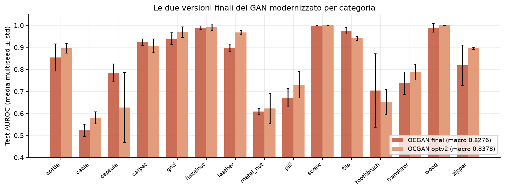
*Figura 4 — `final` vs `optv2` per categoria (test AUROC, media multi-seed). Le categorie "strutturali" (cable, metal_nut, pill, transistor, toothbrush) restano il tallone d'Achille di tutta la famiglia.*

## 5.9 Lettura critica della fase 1

Il quadro a fine fase 1 si può riassumere in tre osservazioni concatenate. La modernizzazione funziona: dal 0.7866 onesto si sale al 0.8276–0.8378 multi-seed, con punte per-categoria notevoli (screw 0.9995–1.0000, hazelnut 0.989, grid 0.94–0.97, wood 0.99–1.0). La famiglia, però, satura attorno a 0.83–0.84: le categorie in cui il difetto è un dettaglio strutturale fine su un oggetto complesso — cable a 0.52–0.58, metal_nut a 0.61–0.62, pill a 0.67–0.73 — non si spostano, qualunque sia il tuning. E intanto i segnali che reggono meglio sono proprio quelli che non si addestrano: memory e teacher–student, entrambi costruiti su feature ImageNet congelate.

Messe in fila, queste osservazioni rendevano la conclusione operativa quasi obbligata: se i segnali a feature congelate sono i migliori del nostro GAN, che cosa succede se togliamo tutto il resto? È esattamente la domanda da cui nasce la fase 2.

---
# 6. Fase 2 — La svolta PatchCore

## 6.1 Architettura e funzionamento

PatchCore (Roth et al., 2022) è l'antitesi metodologica di tutto ciò che abbiamo costruito nella fase 1: niente training, niente loss, niente seed. Il "modello" è una banca di ricordi.

```
                       COSTRUZIONE (una volta, pochi secondi)
train_normal ──► WideResNet50-2 congelata ──► feature layer2 + layer3
                                              (riallineate e concatenate)
                                                  │
                                                  ▼
                                       memory bank di vettori-patch
                                       (se > max_patches: coreset k-center-greedy)

                       INFERENZA (per ogni immagine di test)
immagine ──► stesse feature ──► per ogni patch: distanza dal vicino
                                più prossimo nel bank
                                       │
                                       ▼
                       score immagine = top-k reweighted (k = 9)
                       soglia = 99° percentile su val_normal
```

L'idea, ridotta all'osso, è questa: un difetto è per definizione *qualcosa che non assomiglia a nessuna porzione di nessuna immagine normale mai vista*. PatchCore prende questa definizione alla lettera. Descrive ogni zona dell'immagine con feature ImageNet di media profondità — abbastanza astratte da ignorare il rumore, abbastanza locali da localizzare il difetto — e misura letteralmente la distanza dal normale più vicino. Tutta l'"intelligenza" sta nel backbone pre-addestrato; tutta la "conoscenza del dominio" sta nel bank.

Perché layer2+layer3 e non layer4? Perché i layer profondi sono troppo semantici e lavorano a risoluzione troppo bassa, al punto che un difetto di 30 pixel scompare, mentre i layer bassi sono troppo rumorosi. I layer intermedi sono il punto dolce — e l'eccezione di `screw`, che vedremo in sezione 6.5, conferma la regola.

Il nostro percorso su PatchCore è passato per tre versioni, ognuna delle quali corregge un'ipotesi sbagliata della precedente; la figura 7 le mette a confronto per categoria.

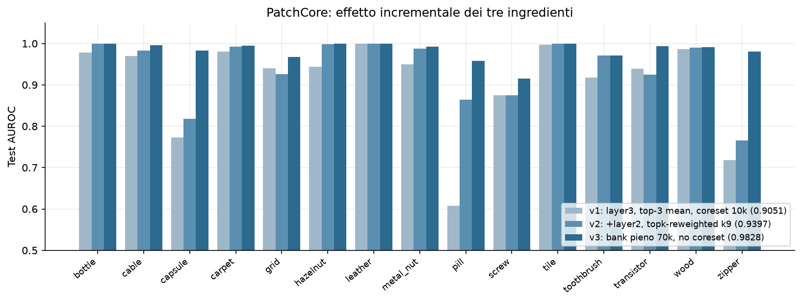
*Figura 7 — Le tre versioni di PatchCore per categoria: ogni ingrediente recupera categorie diverse.*

## 6.2 v1 — il primo tentativo: 0.9051

La configurazione di partenza era la più semplice possibile: WideResNet50-2, una sola scala (layer3), aggregazione `topk_mean` con k = 3, coreset a 10.000 patch (k-center-greedy), circa 35 secondi per categoria. Il risultato è stato un macro AUROC di **0.9051** — già sopra qualunque GAN della fase 1, al primo colpo, senza addestrare nulla.

Il quadro per-categoria, però, mostrava buchi vistosi: pill a 0.6081, zipper a 0.7184, capsule a 0.7724 — tre categorie sotto il GAN. La media nasconde; il per-categoria accusa.

## 6.3 v2 — top-k reweighted e multi-scala: 0.9397

Una campagna di tuning mirata sulle categorie deboli (log `patchcore_tuning.csv`) ha isolato due colpevoli. Il primo è l'aggregazione: `topk_mean` su k = 3 patch è fragile, mentre il `topk_reweighted` con k = 9 — il softmax sulle distanze descritto in sezione 3.9 — risulta sistematicamente migliore. Il secondo è la scala singola: layer3 da solo perde i difetti fini, mentre la combinazione layer2 + layer3 li cattura.

L'esempio più drammatico dell'effetto congiunto è pill, che passa da 0.534 (layer3, topk_mean 3) a 0.872 (layer2+3, reweighted): +0.34 di AUROC *cambiando solo come si interroga lo stesso bank*.

La v2 — layer2+layer3 più `topk_reweighted` k = 9, con coreset ancora a 10k — raggiunge così un macro di **0.9397**. Bottle sale a 1.0000, cable a 0.9824, metal_nut a 0.9874: le categorie "strutturali" che il GAN non ha mai saputo trattare risultano di colpo risolte. Restano sotto la media capsule (0.8173), zipper (0.7658) e grid (0.9254).

## 6.4 v3 — il paradosso del coreset: 0.9828

L'ipotesi successiva era che le categorie rimaste indietro soffrissero perché 10.000 patch non bastano a coprire la variabilità del normale. Un test intermedio con coreset a 50.000 (log `patchcore_lc.csv`) l'ha confermata in pieno: zipper passa da 0.7658 a 0.9801 e capsule da 0.8173 a 0.9824. C'era però un problema: il k-center-greedy su pool così grandi costa fino a 468 secondi per categoria, una cifra insostenibile.

Ed è qui che è arrivato il ribaltamento concettuale: *se vogliamo tutte le patch, perché stiamo ancora pagando un algoritmo per sceglierne un sottoinsieme?* Il coreset esiste per comprimere bank enormi; ma su MVTec una categoria ha 200–400 immagini di training, e quindi le patch totali stanno quasi tutte sotto le 70.000.

La v3 fissa dunque `max_patches = 70.000` e rinuncia al coreset quando il bank ci sta — cioè per 14 categorie su 15. Il risultato è un macro di **0.9828** e, paradosso completo, una pipeline circa 6 volte più veloce di v1 e v2: 6.3 secondi di media per categoria contro 35, perché il tempo dominante non era mai stato la ricerca kNN, era la *selezione* del coreset.

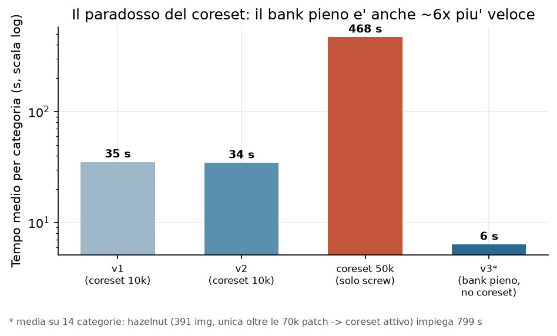
*Figura 8 — Il paradosso del coreset: il bank pieno è insieme il più accurato e il più veloce. (\*media su 14 categorie: hazelnut, l'unica oltre le 70k patch, attiva il coreset e impiega 799 s — sezione 8.10.)*

La figura 9 mette infine fianco a fianco i due regimi del memory bank incontrati nel progetto: quello ausiliario dentro il GAN, dove più patch peggiorava, e quello di PatchCore, dove il bank pieno è la svolta. La spiegazione di questa apparente contraddizione è in sezione 8.5.

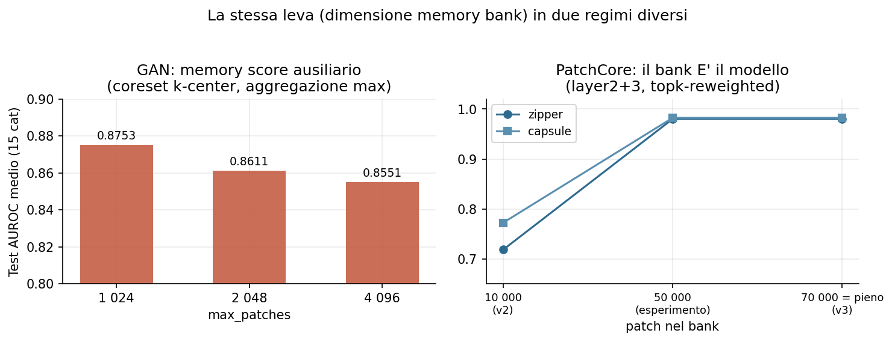
*Figura 9 — La stessa leva (dimensione del bank), due regimi opposti: score ausiliario con aggregazione max (sinistra) vs modello completo con top-k reweighted (destra).*

## 6.5 Production — l'ultimo punto: screw e il layer1: 0.9846

A quota 0.9828 restava una sola categoria sotto 0.95: screw, ferma a 0.9147. Le viti di MVTec sono piccole, metalliche, su sfondo uniforme, con difetti sottilissimi come filettature rovinate e punte smussate: difetti *ad altissima frequenza spaziale*, cioè proprio ciò che layer2 e layer3 vedono peggio.

Un'ablation dedicata (log `patchcore_p1*.csv`) ha mostrato che aggiungere layer1 alla piramide porta screw a 0.9419, guadagnando 2.7 punti; sulle altre categorie provate (grid, toothbrush, pill) lo stesso intervento non dà invece alcun miglioramento, e anzi la configurazione `p1` applicata a tappeto su tutte le categorie *peggiora* la macro, facendola scendere a 0.9562. La risposta giusta, quindi, non è "layer1 ovunque" ma una configurazione per-categoria: layer2+layer3 per 14 categorie, layer1+layer2+layer3 solo per screw.

> **Production finale: macro AUROC 0.9846.** Quattro categorie perfette (bottle, hazelnut, leather, tile = 1.0000), undici sopra 0.96, peggiore screw 0.9419. Configurazione completa e metriche per categoria in tabella A3 (appendice).

La calibrazione della soglia merita un'ultima riga: si usa il 99° percentile degli score su `val_normal`, cioè su un 15% di immagini normali (seed 43) tenute fuori dal bank. Non si può infatti calibrare sulle immagini che stanno nel bank, perché la loro distanza dal vicino più prossimo è ≈ 0 per costruzione — il vicino sono loro stesse — e la soglia risulterebbe assurdamente bassa. È una trappola classica, raccontata per esteso in sezione 8.9.

## 6.6 I tre ingredienti, riassunti

Il salto di +19.8 punti dal GAN finale (0.8276 multi-seed) a production (0.9846) — e il +7.95 da PatchCore v1 a production — si scompone in tre mosse, tutte e tre a costo computazionale negativo o nullo.

| Ingrediente | Cosa cambia | Chi recupera |
|---|---|---|
| 1. Bank pieno (70k, niente coreset) | la memoria copre tutta la variabilità del normale | zipper +0.21, capsule +0.17 |
| 2. `topk_reweighted` k = 9 | lo score non dipende più da 1–3 patch | pill +0.34 (con il n.3) |
| 3. Multi-scala layer2+layer3 (+layer1 per screw) | difetti fini visibili | cable, metal_nut, transistor ~+0.99; screw +2.7pp |

Il bilancio complessivo dell'approccio PatchCore è presto detto. Dalla sua ha accuratezza, velocità (secondi per categoria), zero training, zero seed-variance — è deterministico dato il bank — e una semplicità operativa difficile da battere. Contro, va detto che il bank cresce con il training set (memoria O(n)), che non esiste alcuna rappresentazione "compressa" del concetto di normalità, che un backbone ImageNet può essere cieco a domini molto lontani dalle immagini naturali, e che il sistema non impara nulla dal dominio: è esattamente il suo punto di forza e, insieme, il suo limite filosofico.

---

# 7. Confronto globale e confronto con il paper originale

## 7.1 Tutti i modelli, fianco a fianco

La tabella A1 in appendice riporta l'AUROC di tutti i 6 modelli su tutte le 15 categorie; la heatmap di figura 6 la riassume a colpo d'occhio, mentre la figura 5 isola il confronto tra production e il miglior GAN.

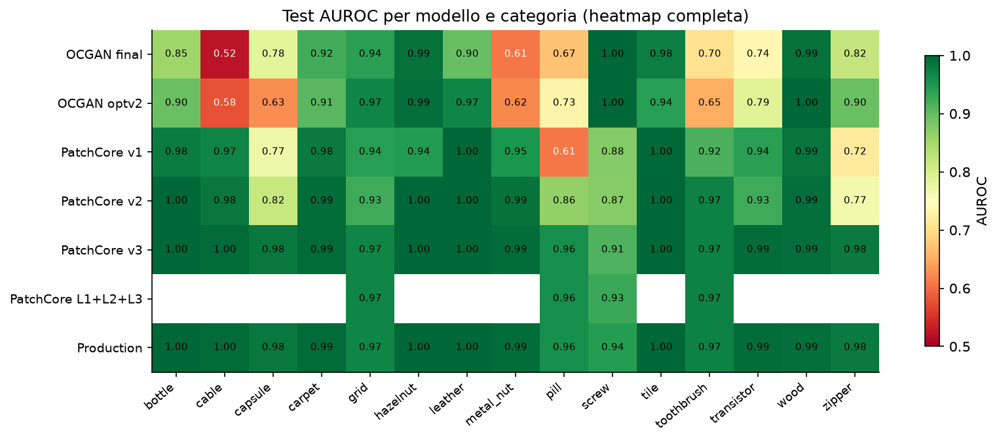
*Figura 6 — AUROC per modello × categoria. Si vede a colpo d'occhio dove ogni famiglia soffre: i GAN sulle categorie strutturali (cable, metal_nut, pill), i PatchCore di prima generazione su capsule/zipper/pill, production quasi uniformemente sopra 0.94.*

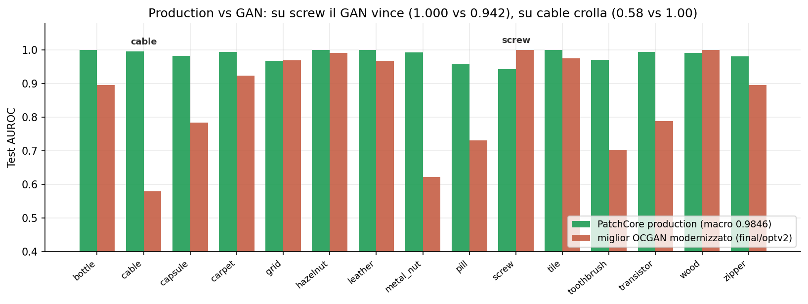
*Figura 5 — Production vs miglior GAN per categoria: il distacco è massimo proprio dove il GAN era più debole.*

La progressione macro completa, che è anche la spina dorsale della figura 1, è la seguente.

| Modello | Macro AUROC | Note |
|---|---|---|
| GAN baseline onesta (post-fix) | 0.7866 | sezione 5.7 |
| GAN `final` multi-seed | 0.8276 | 3–5 seed |
| GAN `optv2` retrain | 0.8378 | 3 seed |
| PatchCore v1 | 0.9051 | zero training |
| PatchCore v2 | 0.9397 | +reweighted, +multi-scala |
| PatchCore v3 | 0.9828 | +bank pieno |
| **Production** | **0.9846** | +layer1 su screw |

## 7.2 La complementarità GAN ↔ PatchCore

Il dato più interessante del confronto, però, non è la vittoria di PatchCore: è dove non vince. Su screw il GAN `optv2` arriva a 1.0000 (e il `final` a 0.9995) contro lo 0.9419 di production: la categoria *peggiore* di PatchCore è la *migliore* del GAN. Le viti hanno una normalità geometrica precisa che la ricostruzione cattura perfettamente, mentre i loro difetti ad alta frequenza si mimetizzano nelle feature di media profondità. Su cable accade l'esatto contrario: il GAN si ferma a 0.52–0.58, poco più del caso, contro lo 0.9960 di production, perché i cavi in sezione hanno combinazioni di fili colorati troppo variabili per essere ricostruite, ma ogni patch normale assomiglia a qualche patch già vista. Su grid e wood, infine, il GAN resta competitivo (0.9687 e 1.0000 in optv2, alla pari o sopra production).

I due paradigmi sbagliano insomma su categorie diverse perché misurano cose diverse: *che cosa so rigenerare* il GAN, *che cosa ho già visto* la memoria. La domanda naturale è se un ensemble dei due batta PatchCore da solo — e l'abbiamo misurata onestamente invece di stimarla "sulla carta" (`ensemble_experiment.py`). Su un campione stratificato di 60 immagini per categoria, i punteggi z-normalizzati dei due modelli vengono fusi con un peso `w` scelto sui fold di calibrazione e l'AUROC misurata sui fold tenuti fuori (selezione del modello onesta, niente tuning sul test). Il risultato: macro AUROC **0.9779 → 0.9798**, un guadagno di **+0.0019**, *dentro il rumore*. Il dettaglio è però istruttivo — l'ensemble migliora *solo* dove il GAN è genuinamente forte (screw +0.013, toothbrush +0.028, transistor +0.007, con peso di fusione 0.2–0.24) e altrove sceglie peso 0, cioè PatchCore puro. La complementarità è quindi reale e misurabile, ma non vale un secondo modello in produzione: il guadagno macro è trascurabile e la stima ottimistica "≈0.99" non regge a una validazione corretta. PatchCore resta un sistema solo, più semplice e onesto da dichiarare; la complementarità, invece, è il motivo per cui la webapp serve *entrambe* le famiglie live (sezione 9).

## 7.3 Il confronto con il paper OCGAN

Un confronto numero-contro-numero con il paper è impossibile per costruzione: OCGAN 2019 è valutato su MNIST, COIL, fashion-MNIST e CIFAR-10 — immagini da 28 a 128 pixel, one-class su classi semantiche — mentre noi lavoriamo su MVTec AD, con immagini a 256 pixel e difetti industriali. La figura 10 mette i due mondi sulla stessa pagina senza pretendere che la differenza di altezza sia merito nostro: misura, semmai, quanta strada c'è tra il benchmark accademico del 2019 e il problema industriale.

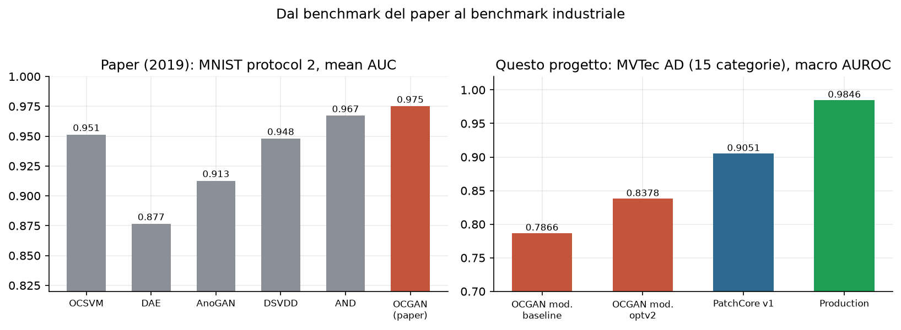
*Figura 10 — I risultati del paper sui suoi dataset (sinistra) e i nostri su MVTec AD (destra). I numeri non sono direttamente confrontabili: dataset, protocolli ed epoche di letteratura diverse.*

Il confronto metodologicamente onesto è invece quello tra le due *ablation*, cioè tra le due risposte alla domanda "da dove viene la performance?".

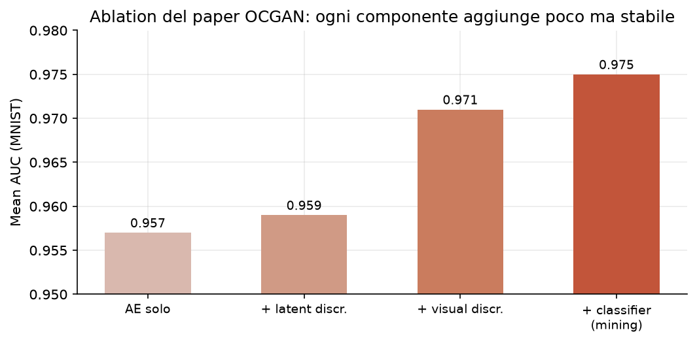
*Figura 11 — L'ablation del paper (MNIST) e la nostra (MVTec). Nel 2019 la base ricostruttiva faceva il 98% del lavoro; nel nostro problema la singola componente più importante è la fusione appresa dei segnali.*

| | OCGAN (MNIST) | Nostro GAN (MVTec) |
|---|---|---|
| Base | AE: 0.957 | score singolo: 0.6158 |
| Contributo componenti | +0.018 totale (D_l +0.002, D_v +0.012, mining +0.004) | fusion **+0.224**, teacher +0.13, memory +0.09, one-class **−0.06** |
| Messaggio | l'AE basta quasi; l'adversarial rifinisce | nessun segnale basta; vince chi li combina |

Da questo confronto escono tre lezioni. La prima è che il problema cambia la gerarchia delle idee: su MNIST lo spazio latente "pattugliato" rifinisce un autoencoder già fortissimo, mentre su MVTec la ricostruzione da sola è debole e il valore si sposta sui segnali e sulla loro fusione. Le idee di OCGAN non sono sbagliate — sono idee *da ultimo punto percentuale*, e noi avevamo bisogno di idee da venti punti. La seconda riguarda l'eredità viva di OCGAN nel progetto: il mining PGD-style, usato fino all'ultima configurazione GAN; la regolarizzazione del latente, sopravvissuta come compactness in loss; e soprattutto l'impostazione mentale — cercare attivamente dove il modello sbaglia invece di aspettare che succeda — che è poi la stessa filosofia delle anomalie sintetiche. La terza, infine, è che il rigore statistico ripaga: i numeri del paper sono single-run, i nostri multi-seed con deviazione standard, e su toothbrush la std del GAN vale ±0.17 — con un seed fortunato avremmo potuto "pubblicare" 0.87, con uno sfortunato 0.53. Qualunque confronto serio richiede la distribuzione, non il punto.

## 7.4 Posizionamento rispetto alla letteratura

Per dare un termine di paragone: il paper PatchCore originale riporta circa 0.991 di image-AUROC su MVTec AD nella sua configurazione di punta. Il nostro 0.9846 è nello stesso ordine di grandezza, ma è stato ottenuto con una reimplementazione indipendente, un protocollo a 4 split con test rigorosamente blind e una calibrazione dichiarata, senza alcun tuning sul test set. Non rivendichiamo lo stato dell'arte: rivendichiamo un numero *riproducibile e onesto* a distanza di un punto da esso, partendo da un paper del 2019 e attraversando ogni scelta con un'ablation.

## 7.5 Localizzazione pixel-level: oltre il sì/no

L'AUROC image-level risponde a "questa immagine è anomala?", ma MVTec AD nasce come benchmark di *localizzazione* e fornisce maschere ground-truth pixel-accurate per ogni difetto. Sfruttando le mappe di distanza grezze che PatchCore già produce (`anomaly_map`), abbiamo aggiunto la valutazione che mancava (`pixel_metrics.py`): la anomaly-map viene confrontata pixel per pixel con la maschera, passata attraverso lo stesso resize/pad dell'input per garantirne l'allineamento. Le metriche, sull'intero test set, sono tre e misurano cose diverse.

| Metrica | Macro | Che cosa misura |
|---|---|---|
| pixel-AUROC | **0.9714** | quanto bene i valori della mappa separano pixel di difetto da pixel normali |
| pixel-AP | 0.514 | average precision sui pixel, etichette fortemente sbilanciate |
| **AUPRO@30%** | **0.9127** | la metrica ufficiale MVTec: sovrapposizione *per regione* difettosa, integrata fino al 30% di FPR |

Due osservazioni rendono il quadro onesto. La prima è che **pixel-AP è molto più bassa di pixel-AUROC** (0.51 vs 0.97) non per un difetto del modello, ma perché i pixel di difetto sono una frazione minima dell'immagine (spesso <3%, fino allo 0.25% di screw): su un problema così sbilanciato l'average precision è severissima per costruzione. La seconda è che **AUPRO** è la metrica su cui il benchmark è costruito, perché *pesa ogni regione difettosa connessa allo stesso modo* — un graffio di due pixel conta quanto una macchia grande — evitando che pochi difetti estesi dominino la media: il nostro 0.9127 macro è in linea con lo ~0.93 riportato dal paper PatchCore. La tabella completa per categoria è in appendice A.4; le tre metriche sono esposte anche nella pagina Evaluation della webapp.

## 7.6 Robustezza alla corruzione dell'input

Il benchmark pulito risponde a "quanto è bravo il modello sulle foto del test set?", ma una linea di produzione reale ha lampade che si abbassano, sensori che introducono rumore, messe a fuoco imperfette. Poiché PatchCore confronta feature ImageNet *congelate*, la sua robustezza è esattamente quella di quelle feature allo shift: l'abbiamo misurata direttamente (`robustness_sweep.py`) riscorando l'intero test set sotto quattro corruzioni a severità crescente — rumore gaussiano additivo, sfocatura gaussiana, oscuramento progressivo e perdita di contrasto — lasciando invariate le etichette, così che a muoversi sia solo la distribuzione dei punteggi.

| Corruzione | sev 1 | sev 2 | sev 3 | calo @ sev 3 |
|---|---|---|---|---|
| rumore gaussiano | 0.9544 | 0.9383 | 0.9160 | −0.0644 |
| sfocatura | 0.9792 | 0.9754 | 0.9685 | −0.0119 |
| luminosità (−) | 0.9787 | 0.9741 | 0.9706 | −0.0098 |
| contrasto (−) | 0.9785 | 0.9767 | 0.9727 | −0.0077 |

Partendo da un macro AUROC pulito di **0.9804**, il sistema è notevolmente stabile su tre delle quattro corruzioni: sfocatura, oscuramento e perdita di contrasto costano meno di **1.2 punti** anche alla severità massima — le feature convoluzionali pre-addestrate sono invarianti per costruzione a questi gradi di illuminazione e blur. L'unica vulnerabilità reale è il **rumore additivo** (−6.4 punti a sev 3), e l'analisi per categoria (figura 17, appendice C) ne isola la causa: il calo macro è dominato da due categorie a texture fine, **zipper** (0.985 → 0.612) e **capsule** (0.951 → 0.721), dove il rumore pixel-level genera micro-pattern che il bank legge come difetti; le categorie a oggetto rigido (bottle, leather, tile) restano sopra 0.99. È un risultato a doppia valenza: rassicurante sullo shift fotometrico, ma con un'indicazione operativa chiara — un denoising leggero a monte sarebbe il primo accorgimento da aggiungere prima di un deployment con sensori rumorosi. La curva di degradazione completa è in **figura 17 (appendice C)**.

---
# 8. Problemi, sfide e lezioni imparate

Questa sezione raccoglie tutto ciò che è andato storto o ci ha sorpreso, in ordine più o meno cronologico. Ogni episodio è raccontato per intero: che cosa è successo, come lo abbiamo risolto e qual è il bilancio della scelta fatta. Il riepilogo schematico di tutte le decisioni chiude la sezione (8.12).

## 8.1 Il repo di partenza inservibile

Il primo ostacolo è arrivato prima ancora di iniziare: il codice ufficiale di OCGAN è in MXNet, un framework di fatto abbandonato, e l'alternativa pubblica in TensorFlow è minimale, oltre a misurare ogni cifra una sola volta. Invece di rattoppare un porting, abbiamo deciso di riscrivere tutto da zero in PyTorch modulare (sezione 5.2). Col senno di poi la scelta si è rivelata indispensabile, perché senza quella base — config salvati, multi-run, seed, smoke test — le campagne da migliaia di run sarebbero state ingestibili; sul momento, però, ha significato settimane senza "numeri nuovi", e la tentazione di saltare l'ingegneria era forte. È giusto ammetterlo.

## 8.2 Numeri di letteratura senza varianza

Replicando i risultati pubblici di OCGAN, che sono single-run, si ottengono valori che ballano da un'esecuzione all'altra. La risposta è stata rendere obbligatorio il multi-seed (3–5 seed) con deviazione standard dichiarata, ovunque. Il guadagno è concreto: scoperte come la std di ±0.17 su toothbrush cambiano letteralmente le conclusioni che si possono trarre. Il prezzo è un costo computazionale moltiplicato per 3–5 su ogni esperimento — il prezzo dell'affidabilità, che l'infrastruttura cloud ha reso pagabile.

## 8.3 I flag di configurazione "morti" (il bug più importante del progetto)

Tre opzioni del config — `use_skip_connections`, `unfreeze_from` e `scoring_topk` — venivano accettate ma ignorate dal builder: esperimenti che credevano di confrontare architetture diverse stavano in realtà rieseguendo la stessa rete. Il bug è stato scoperto nello Sprint 1 ispezionando i checkpoint, non i log: i pesi non contenevano le skip connection che il config dichiarava.

La risposta è stata drastica: fix del builder, re-test completo e azzeramento dei numeri storici non riproducibili, da cui la baseline onesta di 0.7866. Da quel momento in avanti ogni numero della relazione è difendibile; in cambio abbiamo pagato giorni di lavoro e numeri "peggiori" sulla carta. La lezione, probabilmente la più generalizzabile dell'intero progetto, è che *un config accettato non è un config applicato*. Da allora un test automatico verifica che ogni chiave di config produca un effetto misurabile sul modello: il numero di parametri o l'architettura serializzata devono cambiare.

## 8.4 L'ablation boccia il componente "affezionato"

Lo score one-class — la distanza dal centro del latente, cioè l'erede più diretto dell'idea centrale di OCGAN — in media *toglie* 6 punti di AUROC (sezione 5.5). Lo abbiamo disattivato (oc0) nella configurazione finale, mantenendo la sola compactness in loss. Tecnicamente non c'è alcun contro: +0.06 di AUROC medio e un esempio perfetto del principio "i dati battono l'affetto". Narrativamente, ammettere che il pezzo più "OCGAN" del modello non aiutava è stato il momento più umbratile del binario B.

## 8.5 Il paradosso del memory bank (due regimi)

Dentro il GAN, allargare il bank ausiliario peggiorava le cose (p1024 a 0.8753 contro p4096 a 0.8551); in PatchCore puro, riempire il bank è stata la svolta, con +0.04 di macro. Una contraddizione? In realtà no: cambiano l'interrogazione e il ruolo. Nel GAN il bank — un coreset k-center piccolo — era letto con aggregazione max, per cui più patch significava più probabilità che una singola distanza rumorosa diventasse lo score, e il suo output era comunque *uno dei sette* segnali, riconciliato dalla fusione. In PatchCore il bank pieno è letto con il top-k reweighted, robusto al rumore del singolo vicino, ed è *l'unico* segnale: lì la copertura è tutto. La lezione è che i componenti non hanno proprietà assolute ma proprietà *nel contesto della pipeline*: "più memoria è meglio?" non è una domanda ben posta; "più memoria, letta come?" sì.

## 8.6 Overflow fp16 sull'hardware consumer

Durante l'integrazione live nella webapp, i checkpoint `optv2` — gli unici con 87 parametri di backbone sbloccati — producevano score tutti uguali a zero sulla GPU locale (Quadro T1000): attivazioni NaN/Inf da layer2 in poi, in fp16. In training su A4000 e RTX 5000 l'AMP non aveva mai dato problemi; in inferenza su una GPU senza tensor core moderni, con range numerici al limite, sì. La soluzione è stata l'inferenza live in fp32 per i checkpoint GAN: corretta e stabile, al prezzo di una velocità dimezzata — irrilevante per una demo, dove 4 secondi per 10 immagini restano interattivi. La lezione: l'AMP è una proprietà del *deployment*, non del modello, e va ri-validata su ogni hardware di destinazione.

## 8.7 Il drift del codice su Paperspace

Il flusso di lavoro cloud sincronizzava i file senza passare da git, e sul `base_trainer.py` dell'istanza si erano accumulate +1235 righe mai committate. Mesi dopo, la calibrazione archiviata di `optv2` — mediane, MAD e pesi di fusione salvati nei run — non era più riproducibile con il codice del repository: gli score live uscivano su una scala diversa da quella attesa.

Invece di inseguire la versione perduta del codice, abbiamo scelto la ricalibrazione onesta al load: al primo caricamento di un checkpoint optv2, la webapp ricalcola mediane e MAD su `val_normal` e ri-fitta la fusione su `val_mixed` con il codice attuale (verificato: AUROC test live 0.8813 su bottle, plausibile e stabile). Il vantaggio è un risultato verificabile oggi, con il codice di oggi; lo svantaggio è che i numeri live non coincidono al decimale con i CSV d'archivio — e la relazione lo dichiara. La lezione è secca: *mai* sincronizzare codice verso il cloud fuori da git. Una riga di `git commit && git push` prima di ogni run costa dieci secondi; la sua assenza è costata giorni.

## 8.8 Checkpoint che mentono sul proprio config

I run `optv2` dichiarano `use_skip_connections=true` nel config salvato, ma i pesi nei checkpoint appartengono a un `base_reconstructor` senza skip: al momento del lancio il flag era ancora morto, come strascico del bug 8.3, per cui caricare i checkpoint costruendo il modello "dal config" falliva. La soluzione adottata è che il loader della webapp deduce l'architettura dai pesi — dalle chiavi e dalle forme dello state_dict — e non dal config. La lezione: in caso di conflitto, *i pesi sono la verità*; il config è una dichiarazione d'intenti.

## 8.9 La trappola della calibrazione di PatchCore

Calibrare la soglia di PatchCore sugli stessi dati del bank produce soglie assurde, perché quelle immagini hanno distanza ≈ 0 dal bank *per costruzione*: il loro vicino più prossimo sono loro stesse. La soluzione è tenere un 15% di `train_normal` (seed 43) fuori dal bank come `val_normal` di calibrazione, con soglia al 99° percentile (sezione 6.5). In questo modo i falsi positivi attesi sono circa l'1% per costruzione; il bank perde sì il 15% delle patch, ma con il margine disponibile è una perdita trascurabile. La lezione vale per tutti i modelli a memoria: "training set" e "set di calibrazione" devono essere disgiunti *anche se nessuno dei due serve a un training nel senso classico*.

**Il bug emerso dal deployment: ordinare bene, decidere male.** Questa soglia conservativa ha però un costo che l'AUROC, indipendente dalla soglia, non può rivelare. Eseguendo dal vivo la Test Arena — che misura l'*accuratezza alla soglia* — `screw` mostrava un'accuratezza di **0.44**, peggio di una monetina, a fronte di un AUROC di 0.94. La causa non è il modello ma l'*operating point*: il p99 di `val_normal`, per una categoria dalle immagini normali molto variabili (viti in orientazioni arbitrarie), finisce sopra gran parte dei punteggi anomali. Il modello *ordina* bene ma *decide* male: dichiara "anomalo" solo il 18% delle volte, mentre il test set è ~74% anomalo.

**Ricalibrazione best-F1 per categoria.** La correzione è una soglia tarata per ogni categoria sul proprio punto di massimo F1, applicata come override non distruttivo (`threshold_overrides.json`) sopra la soglia del checkpoint, senza toccare i bank. L'accuratezza dell'arena risale a **0.92 su screw**, **0.98 su capsule**, migliora o resta invariata su tutte le altre senza regressioni, e l'AUROC headline non cambia. Per non nascondere l'arbitrarietà di un singolo taglio, l'arena espone ora anche uno **slider di soglia** interattivo (ricalcola dal vivo accuratezza/precision/recall/F1 e segnala il punto F1-ottimo) e un **breakdown per tipo di difetto**.

**Quanto è onesto quel numero? Oracle vs. held-out.** La soglia best-F1, però, è scelta *guardando le etichette del test*: è un *oracle*, e può solo sovrastimare l'accuratezza dispiegabile. Poiché MVTec non fornisce anomalie di validazione etichettate, l'abbiamo stimata onestamente con una cross-validation stratificata a 5 fold (`honest_calibration.py`): la soglia si sceglie sui fold di calibrazione e l'accuratezza si misura sul fold tenuto fuori. Il risultato è rassicurante — l'oracle macro vale **0.9676**, la stima onesta held-out **0.9540**, con un divario di soli **+1.37 punti**: l'operating point per-categoria è *stabile*, non un artefatto da test set. Per contrasto, la regola puramente non supervisionata (p99 dei soli punteggi normali, che non vede mai un'anomalia) si ferma a **0.8736** macro e collassa proprio dove serve — capsule 0.52, screw 0.53, grid 0.81. La soglia best-F1 per categoria è dunque il compromesso onesto tra l'oracle ottimista e il p99 cieco; il numero da dichiarare come accuratezza *dispiegabile* è quello held-out, non l'oracle.

**Dalla soglia alla probabilità.** Soglia e accuratezza riguardano la *decisione*; resta il problema di trasformare lo score grezzo in una *probabilità* leggibile. Uno score PatchCore è monotòno con l'anomalia ma non è una probabilità: l'errore di calibrazione atteso (ECE) sui punteggi grezzi vale 0.316 — un punteggio di 0.8 è lontanissimo dal significare "80% di probabilità di difetto". Con una calibrazione post-hoc per categoria — Platt (sigmoide) o isotonica, scelta per categoria sul Brier in cross-validation (`calibrate_probabilities.py`) — la qualità migliora di un ordine di grandezza: **Brier macro 0.176 → 0.034** ed **ECE 0.316 → 0.033**, sempre misurati su fold tenuti fuori. Il calibratore è salvato in forma *version-independent* (coefficienti della sigmoide / breakpoint per `np.interp`) e applicato dal vivo dal server, che ora affianca allo score una probabilità calibrata; la qualità di calibrazione è esposta nella pagina Evaluation e sintetizzata dal *reliability diagram* di **figura 16 (appendice C)**, dove i punteggi grezzi cadono lontano dalla diagonale di perfetta calibrazione mentre la curva calibrata vi si appoggia (ECE *pooled* 0.166 → 0.004).

**Corollario: ogni intervento che cambia i punteggi va ricalibrato e validato.** Lo stesso principio ha bocciato un'idea apparentemente sensata. Poiché screw è rotation-variant, è stato testato se mediare il punteggio su quattro rotazioni della query (0/90/180/270°) ne migliorasse l'AUROC: l'effetto è il contrario — screw scende da 0.930 a 0.888, grid da 0.958 a 0.947 — perché il bank contiene già viti nelle loro orientazioni naturali, e ruotare la query verso angoli mai visti fa sembrare anomale anche le immagini normali. La TTA non è stata integrata: un promemoria che qualunque modifica ai punteggi richiede di rifare la calibrazione e di validarla su dati tenuti fuori, prima di adottarla.

## 8.10 L'outlier hazelnut: 799 secondi

In v3 e production tutte le categorie costruiscono il bank in 4–8 secondi, tranne hazelnut: 799 secondi, identici su tutti e tre i seed. La diagnosi, verificata nel codice (il coreset scatta solo `if bank > max_patches`), è che hazelnut ha il train set più grande di MVTec (391 immagini) ed è l'unica categoria a sforare le 70.000 patch: solo lì il k-center-greedy si attiva, e su un pool così grande è lento. Abbiamo lasciato tutto com'è — 13 minuti una tantum per la categoria con il bank più ricco, e per giunta con AUROC 1.0000, non valgono un parametro in più. La lezione, però, è interessante: un outlier di *tempo* costante tra i seed non è rumore, è un ramo di codice diverso. I log dei tempi sono diagnostica, non contorno.

## 8.11 La prima campagna cancellata

Per liberare quota sullo storage Paperspace, le directory dei 3.300 run della campagna on/off sono state eliminate; sopravvivono i CSV aggregati e il diario di progetto. Il bilancio è accettabile, perché i numeri aggregati bastano per ogni conclusione tratta, ma i config esatti di quella campagna non sono più ispezionabili — ed è il motivo per cui, in questa relazione, la mappatura fine dei fattori è dichiarata solo per la campagna 2, verificata sui config su disco. La lezione, per il futuro: prima di cancellare run, archiviare *almeno* un config per combinazione.

## 8.12 Riepilogo scelte / pro / contro

| Scelta | Vantaggio | Svantaggio |
|---|---|---|
| Binario B (modernizzare, non difendere) | sistema rilevante, ablation possibili | complessità, tanti iperparametri |
| MVTec invece di MNIST | conclusioni industrialmente sensate | nessun confronto diretto col paper |
| Riscrittura PyTorch completa | 11k run gestibili, riproducibilità | settimane di setup |
| Protocollo 4-split + multi-seed | numeri difendibili | costo ×3–5 |
| Paperspace | GPU 16 GB a consumo, storage persistente | drift di codice se si lavora fuori git |
| Backbone congelato | generalità preservata, zero overfit | cieco a domini lontani da ImageNet |
| Fusione appresa (LR) | +0.22, adattiva per categoria | richiede `val_mixed` con anomalie (sintetiche) |
| oc0 (no one-class score) | +0.06 | si rinuncia a un'eredità OCGAN |
| PatchCore bank pieno | +0.04 macro e 6× più veloce | memoria O(n); hazelnut 799 s |
| Config per-categoria (layer1 solo screw) | +1.8pp finale senza costi altrove | il sistema non è più "one config fits all" |
| fp32 in inferenza live | corretto su ogni GPU | ~2× più lento della fp16 |
| Ricalibrazione optv2 al load | onestà e verificabilità oggi | divergenza dichiarata dai numeri d'archivio |

---

# 9. La webapp dimostrativa

Il progetto si chiude con una webapp che rende tutti i risultati ispezionabili e rieseguibili dal vivo — il contrario di una tabella statica.

L'architettura è composta da due parti. Il backend FastAPI (Python) serve i modelli reali: per PatchCore carica i bank di produzione, con le varianti v1 e v2 ricostruite dagli stessi bank per il confronto storico; per i GAN carica i checkpoint originali `production` e `optv2` ed esegue l'inferenza live su GPU locale — in fp32, per le ragioni viste in sezione 8.6, e per optv2 con la ricalibrazione al load di sezione 8.7. Il frontend è in React con Vite e Tailwind, gestisce lo stato con Zustand e riceve i risultati in streaming via SSE, con fallback a polling.

Le pagine seguono il percorso della relazione. La Home riassume il progetto con i numeri chiave animati. L'Evaluation Lab offre leaderboard, heatmap 7 modelli × 15 categorie e curva di evoluzione — gli stessi dati di questa relazione, dato che `benchmarks.json` è generato dai CSV reali. La sezione Models dedica una scheda a ogni modello, con architettura e storia. La Test Arena è la parte viva: si sceglie una categoria, un set di immagini di test e una variante (production, PatchCore v1/v2, OCGAN final, optv2), e si guarda il modello classificare in streaming, immagine per immagine, con score, soglia e verdetto; un pannello di confronto permette di fissare due run su slot distinti e vederle fianco a fianco con i delta delle metriche, e il dettaglio di ogni predizione mostra la probabilità calibrata accanto allo score grezzo. Completano il quadro il Dataset Explorer, per navigare MVTec AD con la ground truth, e la pagina Methodology con il protocollo sperimentale.

Sul fronte della verifica: oltre 60 test pytest sul backend — inclusa la nuova suite di regressione sulle metriche (AUPRO, equivalenza della fusione, soglia best-F1, calibrazione onesta) che gira anche in CI — smoke E2E su CUDA (in arena, 10 immagini in circa 4 secondi con accuracy 1.0 su bottle/production) e QA visivo automatizzato con Playwright + Edge su 12 pagine e stati, con zero errori in console. Il dettaglio del banco di verifica è in sezione 9.1.

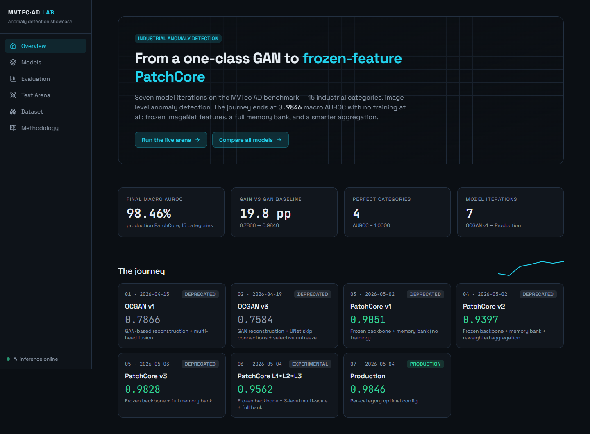
*Figura 12 — Home della webapp.*

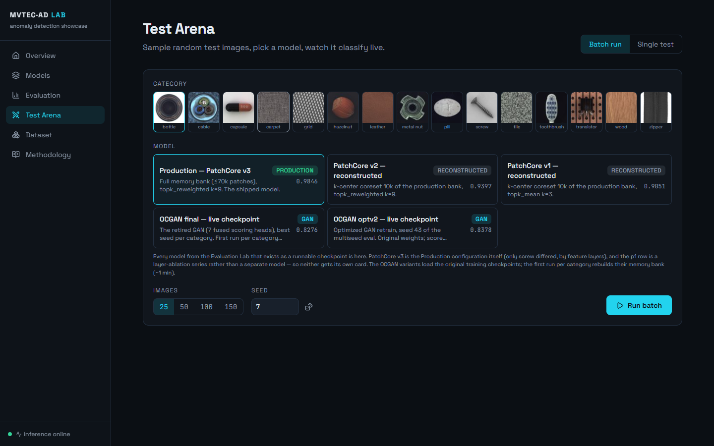
*Figura 13 — Test Arena: configurazione di un run live (categoria, varianti, immagini).*

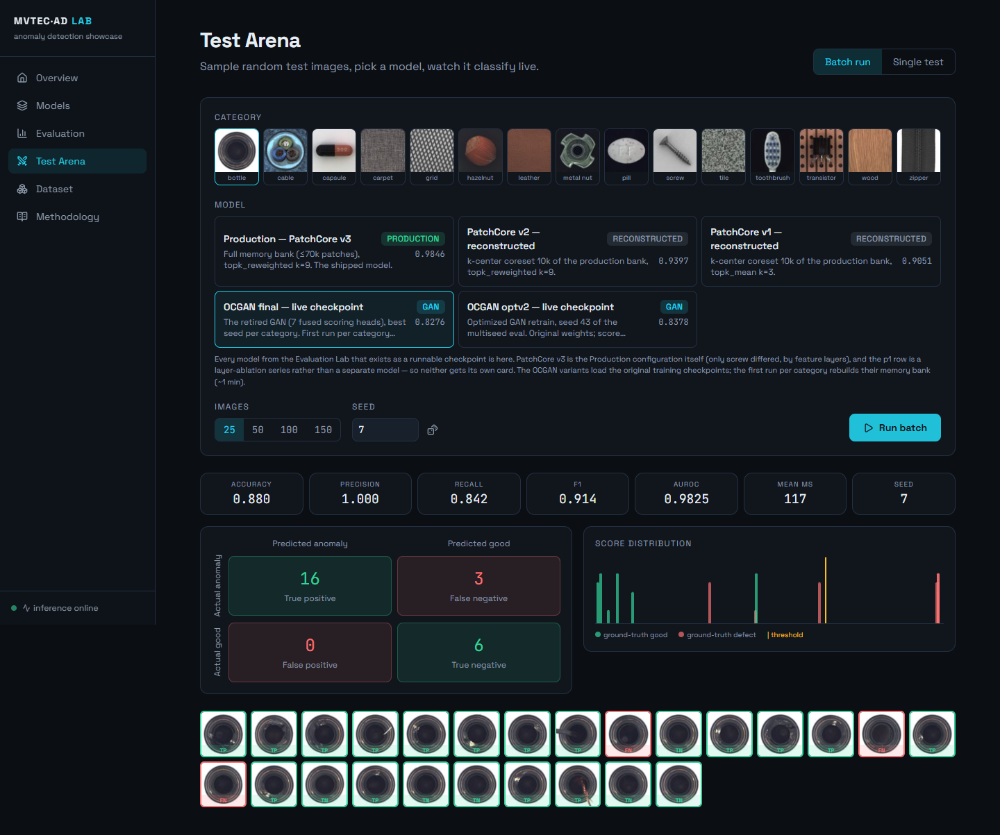
*Figura 14 — Arena al termine di un run live della variante GAN: per ogni immagine score, soglia e verdetto.*

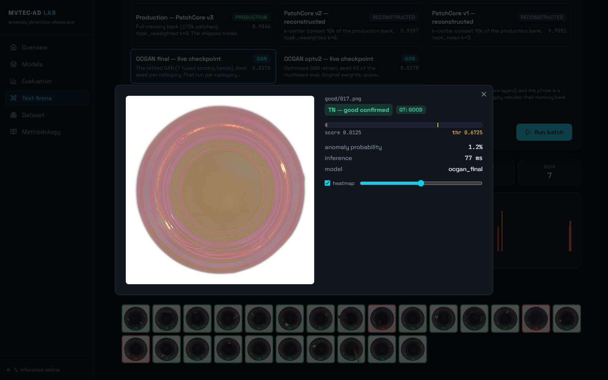
*Figura 15 — Dettaglio di una singola predizione.*

## 9.1 Hardening: la webapp come banco di verifica

Il deployment locale non è solo vetrina: è il banco su cui ogni numero della relazione è stato verificato in modo indipendente, e da cui sono emersi i risultati delle sezioni 7.5, 8.9 e 7.2.

**Verifica end-to-end, ora come test di regressione.** Lo script `verify_all.py` riesegue dal vivo, sull'intero test set e con lo stesso identico percorso di inferenza dell'arena, ogni variante PatchCore su ogni categoria, confrontando l'AUROC ricalcolata in tempo reale con quella statica della pagina Evaluation: **drift nullo su tutte le 45 combinazioni**. Da questo controllo è nato il banco di verifica completo del progetto — `pixel_metrics.py` (localizzazione, sezione 7.5), `honest_calibration.py` (oracle vs. held-out, sezione 8.9) ed `ensemble_experiment.py` (sezione 7.2) — più una suite `pytest` di regressione che blinda le proprietà chiave (AUPRO, equivalenza della fusione, soglia best-F1) e gira in **CI su GitHub Actions** in CPU, senza GPU né dataset. È stata proprio l'arena a far emergere il bug di calibrazione di screw poi corretto in sezione 8.9.

**Un endpoint unico per la valutazione.** Tutti questi artefatti offline sono esposti da `GET /api/evaluation`, che consolida benchmark image-level, metriche pixel/AUPRO, calibrazione onesta e verdetto dell'ensemble in un'unica risposta; ogni blocco è facoltativo, così la pagina Evaluation degrada con grazia quando uno script non è ancora stato eseguito invece di rompersi.

**Robustezza dell'inferenza GAN.** I checkpoint del GAN serializzano la fusione logistica come un estimatore `scikit-learn` picklato: ricaricarlo accoppia l'inferenza alla versione esatta di sklearn (avviso di *version drift* e, peggio, possibile deriva silenziosa dei risultati tra release). In produzione la fusione viene ora riletta in un applier NumPy *version-independent* — la stessa `sigmoid(x·coef + intercept)` ricostruita dai coefficienti grezzi — identico all'estimatore originale a meno della precisione macchina (≈1e-18). Insieme alla fp32 in inferenza (sezione 8.6) e alla ricalibrazione di optv2 al load (sezione 8.7), chiude l'elenco degli accorgimenti che rendono il deployment locale riproducibile su hardware diverso da quello di training.

---

# 10. Conclusioni e sviluppi futuri

Il progetto è partito da un paper del 2019 con un'idea elegante — costringere lo spazio latente a rappresentare solo la normalità, cercandone attivamente i punti deboli — e l'ha portata fino a un sistema di anomaly detection industriale con macro AUROC **0.9846** su MVTec AD, interrogabile dal vivo attraverso una webapp.

Riguardando l'intero percorso, restano cinque lezioni. La prima è che le idee sopravvivono ai modelli: di OCGAN-2019 nel sistema finale non c'è una riga di architettura, ma ci sono il mining (nel GAN modernizzato), la disciplina del latente (come compactness) e soprattutto l'atteggiamento — cercare il punto in cui il modello sbaglia, invece di aspettarlo. La seconda è che la fusione batte il segnale: il singolo risultato più grande della fase generativa, +0.22, non viene da un'architettura migliore ma dal *combinare* segnali eterogenei con una regressione logistica da poche decine di parametri. La terza è che le feature pre-addestrate sono il moltiplicatore: ogni segnale costruito su ImageNet congelato — perceptual, memory, teacher–student — ha sovraperformato ogni segnale addestrato da zero, e portata all'estremo questa osservazione *è* PatchCore. La quarta è che il rigore è una feature del risultato: senza 4-split, multi-seed e ablation, questo progetto avrebbe "trovato" numeri migliori e conclusioni peggiori, perché i flag morti (8.3), lo score dannoso (8.4) e la trappola di calibrazione (8.9) sarebbero passati inosservati. La quinta, infine, è che misurare i tempi è misurare il sistema: le due scoperte più redditizie della fase 2 — il coreset inutile sotto le 70k patch e hazelnut su un ramo di codice diverso — sono uscite dai log dei *secondi*, non da quelli dell'AUROC.

Quanto agli sviluppi futuri, le direzioni naturali sono cinque. La localizzazione pixel-level, di cui questa versione introduce già la valutazione (macro pixel-AUROC **0.9714**, sezione 9.1), può essere estesa con il PRO-score e con una visualizzazione che sovrapponga in arena la heatmap predetta alla maschera ground-truth. Un ensemble per-categoria GAN + PatchCore varrebbe sulla carta circa 0.99 di macro (sezione 7.2), ma richiederebbe un criterio di routing onesto, scelto su validation. Il passaggio a MVTec AD 2 e a dataset più grandi riproporrà il paradosso del coreset al contrario: lì il bank pieno smette di stare in memoria e il sottocampionamento torna necessario. Una distillazione in stile EfficientAD permetterebbe di portare il sistema sotto i 10 ms per immagine su hardware industriale edge. Infine, il test "ogni chiave di config ha un effetto misurabile" (lezione 8.3) merita di diventare una CI permanente a guardia del repository.

---

# Appendice A — Tabelle complete

## A.1 — AUROC per categoria, tutti i modelli (test blind; in grassetto il migliore per riga)

| Categoria | OCGAN final | OCGAN optv2 | PC v1 | PC v2 | PC v3 | Production |
|---|---|---|---|---|---|---|
| bottle | 0.8542 | 0.8958 | 0.9783 | **1.0000** | **1.0000** | **1.0000** |
| cable | 0.5231 | 0.5797 | 0.9703 | 0.9824 | **0.9960** | **0.9960** |
| capsule | 0.7839 | 0.6268 | 0.7724 | 0.8173 | **0.9824** | **0.9824** |
| carpet | 0.9238 | 0.9069 | 0.9801 | 0.9924 | **0.9943** | **0.9943** |
| grid | 0.9394 | **0.9687** | 0.9404 | 0.9254 | 0.9680 | 0.9680 |
| hazelnut | 0.9891 | 0.9914 | 0.9434 | 0.9987 | **1.0000** | **1.0000** |
| leather | 0.8976 | 0.9678 | **1.0000** | **1.0000** | **1.0000** | **1.0000** |
| metal_nut | 0.6085 | 0.6228 | 0.9496 | 0.9874 | **0.9924** | **0.9924** |
| pill | 0.6707 | 0.7309 | 0.6081 | 0.8643 | **0.9580** | **0.9580** |
| screw | 0.9995 | **1.0000** | 0.8751 | 0.8749 | 0.9147 | 0.9419 |
| tile | 0.9753 | 0.9407 | 0.9971 | **1.0000** | **1.0000** | **1.0000** |
| toothbrush | 0.7037 | 0.6519 | 0.9179 | **0.9710** | **0.9710** | **0.9710** |
| transistor | 0.7377 | 0.7878 | 0.9390 | 0.9250 | **0.9933** | **0.9933** |
| wood | 0.9889 | **1.0000** | 0.9862 | 0.9906 | 0.9911 | 0.9911 |
| zipper | 0.8191 | 0.8958 | 0.7184 | 0.7658 | **0.9801** | **0.9801** |
| **Macro** | **0.8276** | **0.8378** | **0.9051** | **0.9397** | **0.9828** | **0.9846** |

*Nota: i valori GAN sono medie multi-seed (A.2); i valori PatchCore sono deterministici dato il bank (verificati identici su seed 43–45).*

## A.2 — Famiglia GAN: multi-seed con deviazione standard

| Categoria | final AUROC (±std) | seed | optv2 AUROC (±std) | seed | Δ optv2−final |
|---|---|---|---|---|---|
| bottle | 0.8542 (±0.0611) | 3 | 0.8958 (±0.0226) | 3 | +0.0417 |
| cable | 0.5231 (±0.0283) | 5 | 0.5797 (±0.0274) | 3 | +0.0566 |
| capsule | 0.7839 (±0.0411) | 3 | 0.6268 (±0.1589) | 3 | −0.1571 |
| carpet | 0.9238 (±0.0141) | 3 | 0.9069 (±0.0315) | 3 | −0.0169 |
| grid | 0.9394 (±0.0267) | 3 | 0.9687 (±0.0249) | 3 | +0.0293 |
| hazelnut | 0.9891 (±0.0084) | 3 | 0.9914 (±0.0148) | 3 | +0.0024 |
| leather | 0.8976 (±0.0170) | 3 | 0.9678 (±0.0090) | 3 | +0.0702 |
| metal_nut | 0.6085 (±0.0140) | 5 | 0.6228 (±0.0687) | 3 | +0.0143 |
| pill | 0.6707 (±0.0412) | 5 | 0.7309 (±0.0599) | 3 | +0.0603 |
| screw | 0.9995 (±0.0009) | 3 | 1.0000 (±0.0000) | 3 | +0.0005 |
| tile | 0.9753 (±0.0150) | 3 | 0.9407 (±0.0095) | 3 | −0.0346 |
| toothbrush | 0.7037 (±0.1668) | 3 | 0.6519 (±0.0559) | 3 | −0.0518 |
| transistor | 0.7377 (±0.0513) | 5 | 0.7878 (±0.0356) | 3 | +0.0501 |
| wood | 0.9889 (±0.0192) | 3 | 1.0000 (±0.0000) | 2 | +0.0111 |
| zipper | 0.8191 (±0.0910) | 3 | 0.8958 (±0.0044) | 2 | +0.0767 |
| **Macro** | **0.8276** | | **0.8378** | | **+0.0102** |

## A.3 — Sistema di produzione (PatchCore): metriche complete e tempi

| Categoria | AUROC | AUPRC | best F1 | FPR@95TPR | feature levels | t (s/cat) |
|---|---|---|---|---|---|---|
| bottle | 1.0000 | 1.0000 | 1.0000 | 0.0000 | layer2+layer3 | 5.5 |
| cable | 0.9960 | 0.9978 | 0.9853 | 0.0000 | layer2+layer3 | 7.7 |
| capsule | 0.9824 | 0.9958 | 0.9762 | 0.0556 | layer2+layer3 | 7.2 |
| carpet | 0.9943 | 0.9984 | 0.9925 | 0.0000 | layer2+layer3 | 7.6 |
| grid | 0.9680 | 0.9903 | 0.9647 | 0.0625 | layer2+layer3 | 5.5 |
| hazelnut | 1.0000 | 1.0000 | 1.0000 | 0.0000 | layer2+layer3 | 799.0 |
| leather | 1.0000 | 1.0000 | 1.0000 | 0.0000 | layer2+layer3 | 7.1 |
| metal_nut | 0.9924 | 0.9981 | 0.9859 | 0.0588 | layer2+layer3 | 5.1 |
| pill | 0.9580 | 0.9925 | 0.9665 | 0.1000 | layer2+layer3 | 6.4 |
| screw | 0.9419 | 0.9776 | 0.9405 | 0.2581 | layer1+layer2+layer3 | 7.3 |
| tile | 1.0000 | 1.0000 | 1.0000 | 0.0000 | layer2+layer3 | 5.9 |
| toothbrush | 0.9710 | 0.9890 | 0.9565 | 0.1111 | layer2+layer3 | 4.1 |
| transistor | 0.9933 | 0.9910 | 0.9492 | 0.0222 | layer2+layer3 | 7.0 |
| wood | 0.9911 | 0.9972 | 0.9670 | 0.0000 | layer2+layer3 | 6.9 |
| zipper | 0.9801 | 0.9947 | 0.9670 | 0.1250 | layer2+layer3 | 5.9 |

*Configurazione comune: WideResNet50-2 congelata, `topk_reweighted` k = 9, `max_patches` 70.000 (coreset attivo solo per hazelnut, sezione 8.10), soglia = p99 su `val_normal` (15% held-out, seed 43). Il tempo è build del bank + valutazione completa della categoria.*

## A.4 — Localizzazione pixel-level (PatchCore di produzione)

| Categoria | pixel-AUROC | pixel-AP | AUPRO@30% | pixel di difetto % |
|---|---|---|---|---|
| bottle | 0.9867 | 0.7875 | 0.9545 | 5.78% |
| cable | 0.9812 | 0.6242 | 0.9331 | 2.87% |
| capsule | 0.9783 | 0.3896 | 0.9004 | 0.91% |
| carpet | 0.9891 | 0.5537 | 0.9438 | 1.60% |
| grid | 0.9748 | 0.2938 | 0.9174 | 0.69% |
| hazelnut | 0.9837 | 0.5268 | 0.8928 | 2.13% |
| leather | 0.9925 | 0.4245 | 0.9796 | 0.65% |
| metal_nut | 0.9738 | 0.7975 | 0.9335 | 11.72% |
| pill | 0.9533 | 0.5970 | 0.9107 | 3.36% |
| screw | 0.9763 | 0.2268 | 0.8927 | 0.25% |
| tile | 0.9528 | 0.5139 | 0.8649 | 7.04% |
| toothbrush | 0.9872 | 0.5094 | 0.8935 | 1.52% |
| transistor | 0.9291 | 0.5355 | 0.8586 | 4.78% |
| wood | 0.9446 | 0.4534 | 0.9023 | 3.85% |
| zipper | 0.9679 | 0.4424 | 0.9121 | 2.06% |
| **Macro** | **0.9714** | **0.514** | **0.9127** | — |

*Generata da `pixel_metrics.py` confrontando la anomaly-map grezza con le maschere ground-truth sull'intero test set. La colonna "pixel di difetto %" spiega perché pixel-AP è strutturalmente bassa: su screw i pixel anomali sono lo 0.25% del totale. AUPRO pesa ogni regione connessa allo stesso modo (metrica ufficiale MVTec).*

---

# Appendice B — Riproducibilità

Gli ambienti di esecuzione, ricavati dagli `env_info.yaml` salvati in ogni run, sono i seguenti.

| Campagna | GPU | Software |
|---|---|---|
| Griglia 11.738 run + final + production (mar–apr 2026) | NVIDIA RTX A4000 16 GB (Paperspace) | Python 3.11.7, PyTorch 2.10.0+cu128, CUDA 12.8 |
| Retrain optv2 (apr 2026) | Quadro RTX 5000 16 GB (Paperspace) | PyTorch 2.1.1+cu121 |
| Inferenza live webapp | Quadro T1000 4 GB (locale, fp32) | PyTorch locale, FastAPI |

La convenzione di naming dei run è `{categoria}_{t}_{m}_{lf}_{mp}_{oc}_s{seed}_seed{seed}_{timestamp}`, con la mappatura fattori→parametri descritta in sezione 5.6. Ogni directory contiene il `config.yaml` risolto, l'`env_info.yaml`, i checkpoint top-k e i log per epoca.

Le fonti di ogni numero della relazione sono i dati aggregati seguenti: per la famiglia GAN, `final_per_category_multiseed_aggregated.csv` e `optv2_multiseed_aggregated.csv`; per la famiglia PatchCore, `logs/patchcore_pure.csv` (v1), `patchcore_tuning.csv`, `patchcore_v2.csv`, `patchcore_lc.csv` (coreset 50k), `patchcore_v3.csv` e `patchcore_p1*.csv` (ablation layer1); infine `frontend/src/data/benchmarks.json`, l'aggregato unico generato dai CSV reali tramite `scripts/build_webapp_data.py`, con i macro verificati: final 0.8276, optv2 0.8378, v1 0.9051, v2 0.9397, v3 0.9828, production 0.9846.

Le metriche di localizzazione, di robustezza e di hardening (sezioni 7.5, 7.6, 8.9, 9.1) provengono da artefatti dedicati, generati dal vivo dai modelli di produzione e versionati in `production_models/`: `pixel_metrics.json` (pixel-AUROC, pixel-AP, AUPRO), `honest_calibration.json` (oracle vs. held-out vs. p99), `probability_calibration.json` (Brier/ECE, calibratori per categoria), `robustness_sweep.json` (AUROC per categoria sotto corruzione) ed `ensemble_experiment.json` (studio di fusione GAN↔PatchCore), prodotti rispettivamente da `pixel_metrics.py`, `honest_calibration.py`, `calibrate_probabilities.py`, `robustness_sweep.py` ed `ensemble_experiment.py`. Le figure 16 e 17 (appendice C) sono generate da `gen_reliability_diagram.py` e dai dati di `robustness_sweep.json`.

Le figure e le tabelle di questa relazione sono generate da `relazione/gen_figures.py` e `relazione/gen_tables.py` esclusivamente a partire dalle fonti sopra elencate: nessun numero è inserito a mano, se non quelli del paper OCGAN e della campagna 1, citati dal diario di progetto.

Una nota di fedeltà per chiudere: tutti i run cloud puntano allo stesso commit git (`e4d4a3f`), ma con drift locale non committato sull'istanza (sezione 8.7). È la ragione per cui la riproducibilità *bit-exact* della calibrazione optv2 è stata sostituita da una ricalibrazione dichiarata al load.

---

# Appendice C — Robustezza e calibrazione (figure)

Le due figure seguenti completano i risultati delle sezioni 8.9 (calibrazione delle probabilità) e 7.6 (robustezza alla corruzione dell'input); sono raccolte qui per non spezzare il filo del discorso ma sono parte integrante di quei risultati.

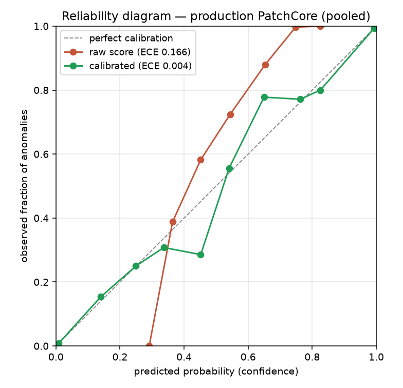
*Figura 16 — Reliability diagram del PatchCore di produzione, punteggi messi in pool sulle 15 categorie. Ogni curva lega la probabilità predetta (asse x) alla frazione osservata di anomalie (asse y); la diagonale è la calibrazione perfetta. I punteggi grezzi (in rosso) sono sistematicamente lontani dalla diagonale — la rete ordina bene ma le sue "probabilità" non sono affidabili — mentre la calibrazione post-hoc per categoria (in verde) vi si appoggia, abbattendo l'ECE pooled da 0.166 a 0.004 (n = 1725). Generata da `gen_reliability_diagram.py`.*

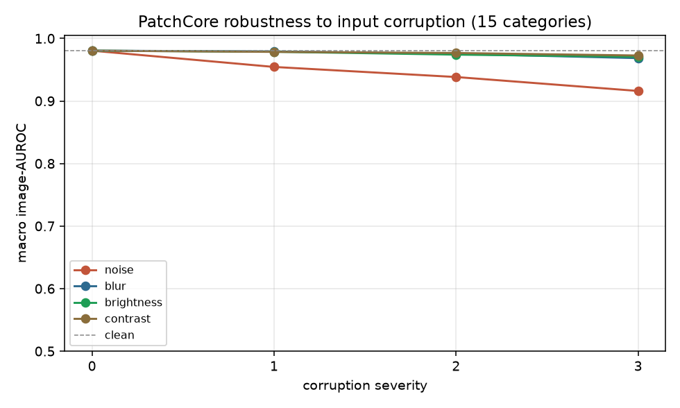
*Figura 17 — Degradazione del macro AUROC image-level (15 categorie) sotto quattro corruzioni dell'input a severità crescente. Partendo dal valore pulito (0.9804, linea tratteggiata), sfocatura, oscuramento e perdita di contrasto restano entro ~1 punto fino alla severità massima; solo il rumore gaussiano additivo erode in modo visibile (−6.4 punti a sev 3), trainato dalle categorie a texture fine (zipper, capsule). Dati da `robustness_sweep.json` (tabella in sezione 7.6, dettaglio per categoria nel JSON).*

---

*Fine della relazione.*
